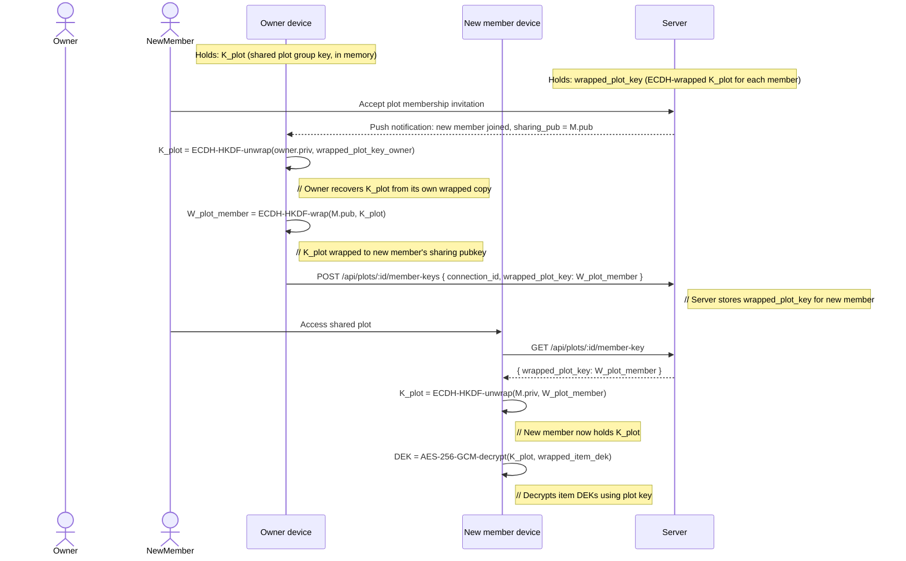

# NOT-001 — Capsule Construction: Sequence Diagrams

**ID:** NOT-001-seq  
**Date:** 2026-05-16  
**Author:** Technical Author  
**Status:** Draft  
**Relates to:** NOT-001, PAP-001, ARCH-003, ARCH-006, ARCH-007, ARCH-008  

---

## Reading guide

Each diagram uses the following knowledge-boundary conventions:

- `Client` — the user's device (Android, Web, or iOS app). Holds `MK` and all derived keys. **The server never sees plaintext key material.**
- `Server` — Heirlooms backend. Sees only ciphertext envelopes and opaque tokens. Never holds `MK`, `DEK`, or `DEK_client`.
- `tlock` — drand public randomness beacon. Publishes round keys on a fixed schedule. Neither the server nor the client can predict future round keys.
- `Executor` — a nominated trusted third party who holds a Shamir share of a capsule DEK.

Knowledge-boundary annotations are written as `// [PARTY knows: X, X, ...]` on the relevant step.

---

## Diagram 1 — Device registration and master key derivation

```mermaid
sequenceDiagram
    actor User
    participant Client
    participant Server

    Note over Client: Knowledge: passphrase, device keypair
    Note over Server: Knowledge: nothing about MK

    User->>Client: Enter passphrase p

    Client->>Client: salt ← random 16 bytes
    Client->>Client: MK = Argon2id(p, salt; m=64MiB, t=3, p=1)
    Note right of Client: // Client knows: MK (never leaves device)

    Client->>Client: (sharing_priv, sharing_pub) ← P-256 keypair
    Client->>Client: wrapped_MK = ECDH-HKDF-wrap(sharing_pub, MK)
    Note right of Client: // Client encrypts MK to its own pubkey for backup

    Client->>Server: POST /register { sharing_pub, wrapped_MK, salt }
    Note right of Server: // Server stores: sharing_pub, wrapped_MK, salt
    Note right of Server: // Server does NOT know: MK, sharing_priv

    Server-->>Client: 200 { user_id, device_id }

    Note over Client: Vault session active; MK held in memory only
```

---

## Diagram 2 — Upload: DEK generation, encryption, wrapping

```mermaid
sequenceDiagram
    actor User
    participant Client
    participant Server

    Note over Client: MK is in session (vault unlocked)
    Note over Server: Server sees only ciphertext

    User->>Client: Select file f to upload

    Client->>Client: DEK ← random 256-bit key
    Client->>Client: nonce ← random 12 bytes
    Client->>Client: (ciphertext, tag) = AES-256-GCM(DEK, nonce, f)
    Note right of Client: // Client knows: DEK, f; produces encrypted blob

    Client->>Client: n_d ← random 12 bytes
    Client->>Client: wrapped_DEK = AES-256-GCM(MK, n_d, DEK)
    Note right of Client: // Envelope: alg=master-aes256gcm-v1

    Client->>Server: POST /uploads { ciphertext, tag, nonce, wrapped_DEK }
    Note right of Server: // Server stores encrypted blob + wrapped_DEK
    Note right of Server: // Server CANNOT recover DEK or f

    Server-->>Client: 200 { upload_id }
```

---

## Diagram 3 — Capsule seal: DEK blinding split, ECDH wrapping, tlock IBE sealing

```mermaid
sequenceDiagram
    actor Author
    participant Client
    participant Server
    participant tlock

    Note over Client: MK in session; capsule content already uploaded
    Note over Server: Will store: DEK_tlock, wrapped keys; NOT DEK_client or DEK

    Author->>Client: Initiate capsule seal (tlock enabled, unlock_at = T)

    Client->>Client: DEK ← random 32 bytes (capsule content key)
    Client->>Client: DEK_client ← random 32 bytes (client-side mask)
    Client->>Client: DEK_tlock = DEK XOR DEK_client
    Note right of Client: // Client knows: DEK, DEK_client, DEK_tlock

    Client->>Client: tlock_key_digest = SHA-256(DEK_tlock)

    Note over Client: ECDH wrapping for each recipient i

    Client->>Client: W_cap_i = ECDH-HKDF-wrap(R_i.pub, DEK)
    Note right of Client: // iOS-compatible path: wraps full DEK

    Client->>Client: W_blind_i = ECDH-HKDF-wrap(R_i.pub, DEK_client)
    Note right of Client: // Android/web path: wraps only DEK_client (the mask)

    Note over Client: tlock IBE sealing

    Client->>tlock: IBE-seal(round_pub_key[r], DEK_client)
    tlock-->>Client: C_tlock (IBE ciphertext of DEK_client)
    Note right of Client: // C_tlock is safe to store server-side: only reveals DEK_client when round r publishes

    Note over Client: Shamir share generation (if enabled)
    Client->>Client: {S_1..S_n} = Shamir(k,n)(DEK)
    Note right of Client: // Shares over DEK, not DEK_client

    Client->>Server: PUT /capsules/:id/seal { recipient_keys: [{W_cap_i, W_blind_i}], tlock: {round=r, C_tlock, DEK_tlock, tlock_key_digest} }
    Note right of Server: // Server stores: W_cap_i, W_blind_i, C_tlock, DEK_tlock, tlock_key_digest
    Note right of Server: // Server DOES NOT know: DEK, DEK_client

    Server->>Server: validate all envelopes; verify SHA-256(DEK_tlock) == tlock_key_digest
    Server-->>Client: 200 { capsule_id, shape: "sealed" }

    Note over Client,Server: DEK and DEK_client exist only on client side; client may discard after sealing
```

---

## Diagram 4 — Capsule delivery: server returns DEK_tlock, client XORs and decrypts

```mermaid
sequenceDiagram
    actor Recipient
    participant Client as Client (Android/web)
    participant Server
    participant tlock as tlock beacon

    Note over tlock: Round r publishes sk_r at time t_r ≤ unlock_at + 1h
    Note over Server: Holds: DEK_tlock, W_blind_i, C_tlock, tlock_key_digest

    tlock->>Server: round_key sk_r published (public beacon)

    Server->>Server: IBE-open(sk_r, C_tlock) → DEK_client' (confirms gate open; NOT stored or returned)
    Note right of Server: // Server uses decryption result ONLY as a gate-check signal

    Recipient->>Client: Open capsule
    Client->>Server: GET /api/capsules/:id/tlock-key

    Server->>Server: Verify SHA-256(DEK_tlock) == tlock_key_digest
    Server->>Server: Check now() >= unlock_at

    Server-->>Client: 200 { dek_tlock: DEK_tlock }
    Note right of Server: // Server has served DEK_tlock; still does NOT know DEK_client

    Client->>Client: DEK_client = ECDH-HKDF-unwrap(R_i.priv, W_blind_i)
    Note right of Client: // Client recovers its mask from ECDH-wrapped copy

    Client->>Client: DEK = DEK_client XOR DEK_tlock
    Note right of Client: // Full DEK reconstructed ONLY on client device

    Client->>Client: f = AES-256-GCM-decrypt(DEK, nonce, ciphertext, tag)
    Note right of Client: // Plaintext file content available to recipient

    Note over Client,Server: SERVER-BLINDNESS PROPERTY: Server held DEK_tlock (one XOR half) but never DEK_client (other half); it never had DEK
```

---

## Diagram 5 — Executor recovery (Shamir reconstruction without tlock)

```mermaid
sequenceDiagram
    actor Executor1
    actor Executor2
    actor Executor3
    participant Client1 as Executor 1 device
    participant Client2 as Executor 2 device
    participant Client3 as Executor 3 device
    participant Server

    Note over Server: Holds: executor_shares (wrapped Shamir shares), threshold k=2, total n=3
    Note over Server: Does NOT hold: DEK or any individual Shamir share in plaintext

    Executor1->>Client1: Initiate executor recovery
    Client1->>Server: GET /api/capsules/:id/executor-shares/mine
    Server-->>Client1: { wrapped_share: W_S1 }

    Client1->>Client1: S1 = ECDH-HKDF-unwrap(E1.priv, W_S1)
    Note right of Client1: // Client1 knows: S1 (its own share only)

    Executor2->>Client2: Initiate executor recovery
    Client2->>Server: GET /api/capsules/:id/executor-shares/mine
    Server-->>Client2: { wrapped_share: W_S2 }

    Client2->>Client2: S2 = ECDH-HKDF-unwrap(E2.priv, W_S2)
    Note right of Client2: // Client2 knows: S2

    Note over Client1,Client2: Threshold k=2 met; reconstruct DEK (off-server)

    Client1->>Client1: DEK = Lagrange-interpolate({(1,S1),(2,S2)})
    Note right of Client1: // DEK reconstructed entirely on executor device
    Note right of Client1: // No interaction with tlock required
    Note right of Client1: // Server was never involved in reconstruction

    Client1->>Client1: Decrypt capsule content with DEK
```

---

## Diagram 6 — Shared plot: plot key exchange when a member joins



---

## Diagram 7 — Tag search: HMAC token generation and server-side lookup

```mermaid
sequenceDiagram
    actor User
    participant Client
    participant Server

    Note over Client: MK in session
    Note over Server: Stores: tag_tokens (HMAC tokens, opaque BYTEA); NO plaintext tags

    User->>Client: Search for tag "grandmother"

    Client->>Client: K_tag = HKDF(MK, salt=[], info="tag-token-v1")
    Client->>Client: T = HMAC-SHA-256(K_tag, UTF-8("grandmother"))
    Note right of Client: // T is a 256-bit opaque token; only this client can produce it

    Client->>Server: GET /api/uploads?tag_token={hex(T)}
    Note right of Server: // Server compares T against stored tag_tokens array values
    Note right of Server: // Server CANNOT recover "grandmother" from T

    Server->>Server: SELECT * FROM uploads WHERE tag_tokens @> ARRAY[T]::bytea[]
    Server-->>Client: { uploads: [...] }

    Client->>Client: For each result, decrypt tag_display_ciphertext with K_disp
    Note right of Client: // Display names decrypted client-side only

    Client->>User: Show matching uploads with tag display name "grandmother"

    Note over Server: SERVER KNOWLEDGE: T appears on these uploads (equality)
    Note over Server: SERVER CANNOT KNOW: what "grandmother" means, or T for any other user
```

---

*These diagrams are embedded by reference in PAP-001 Appendix B. See NOT-001 for formal notation.*
