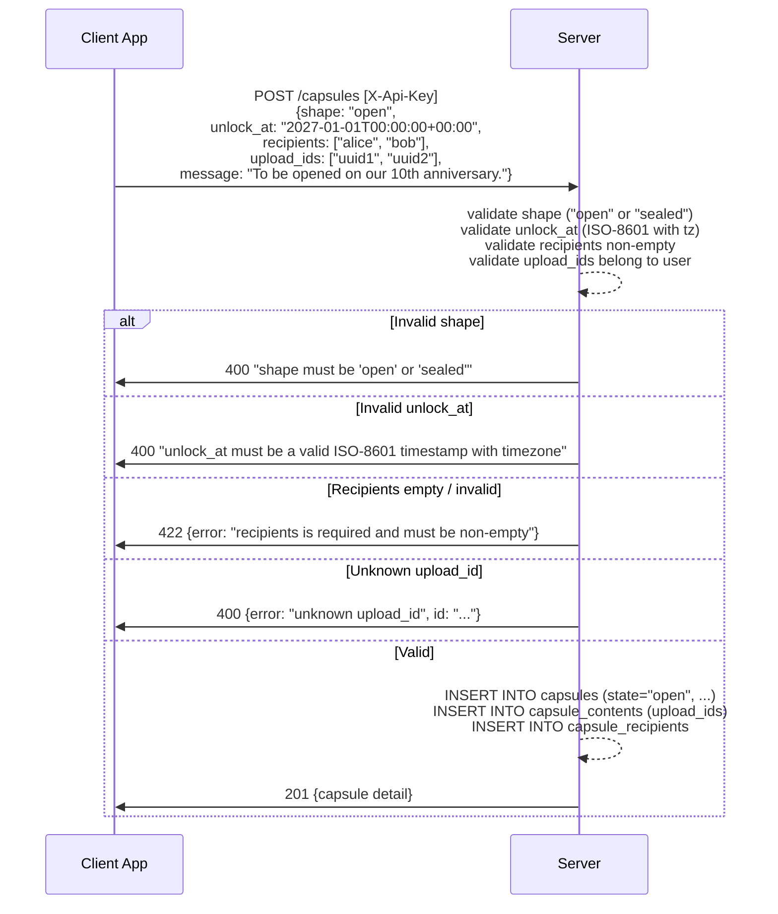
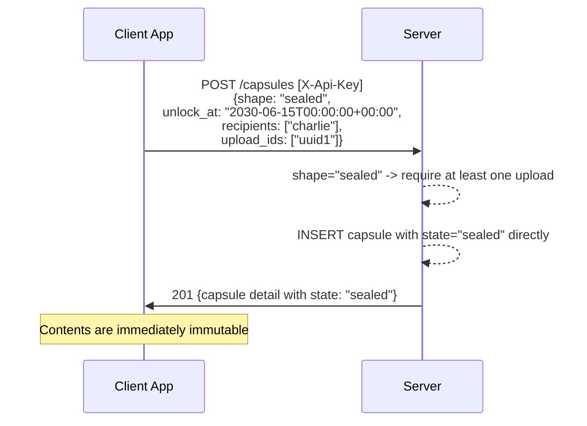
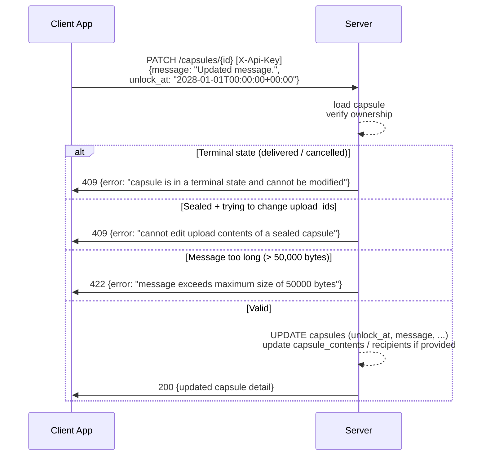
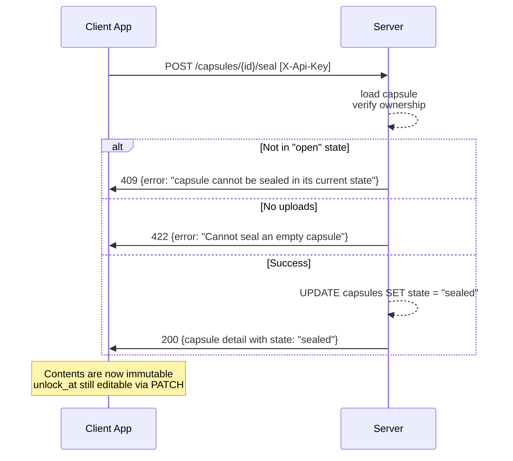
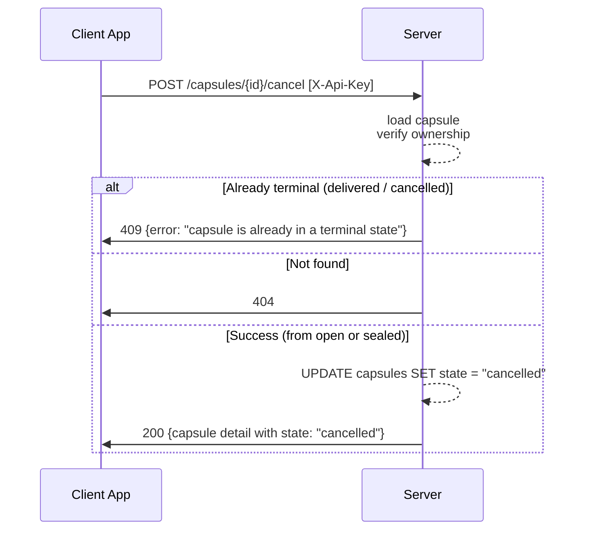
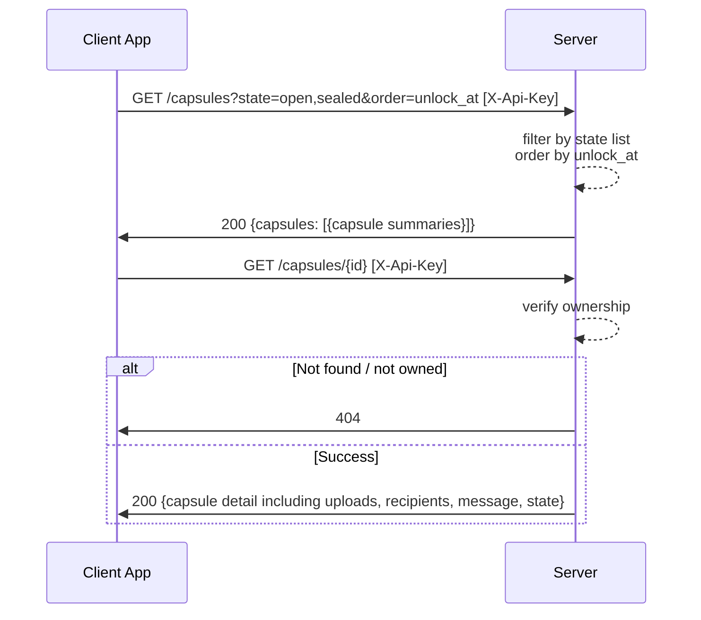
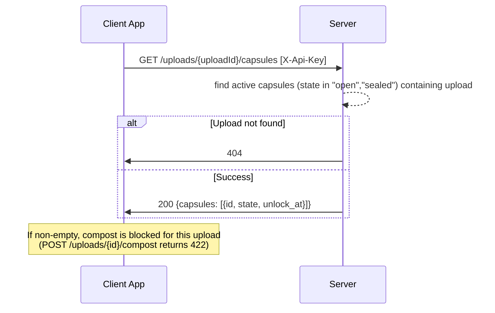
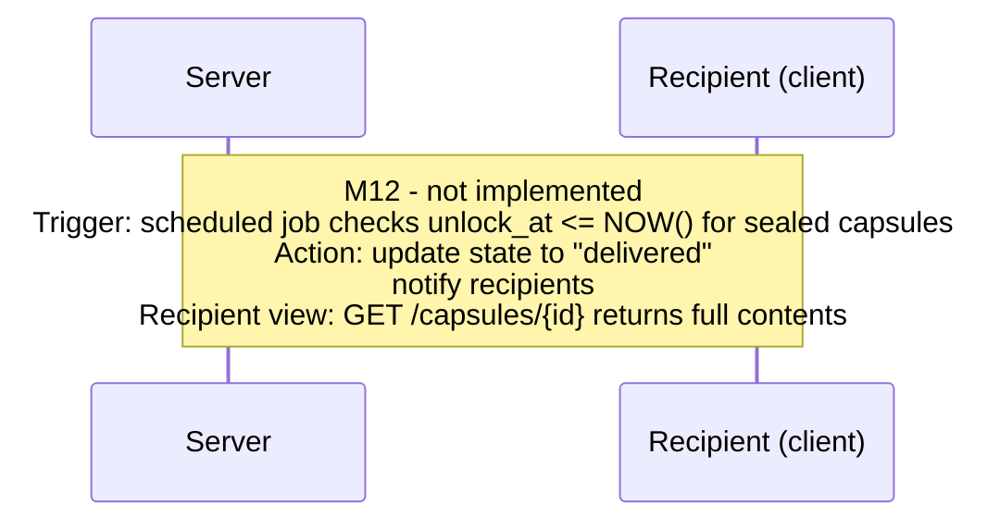
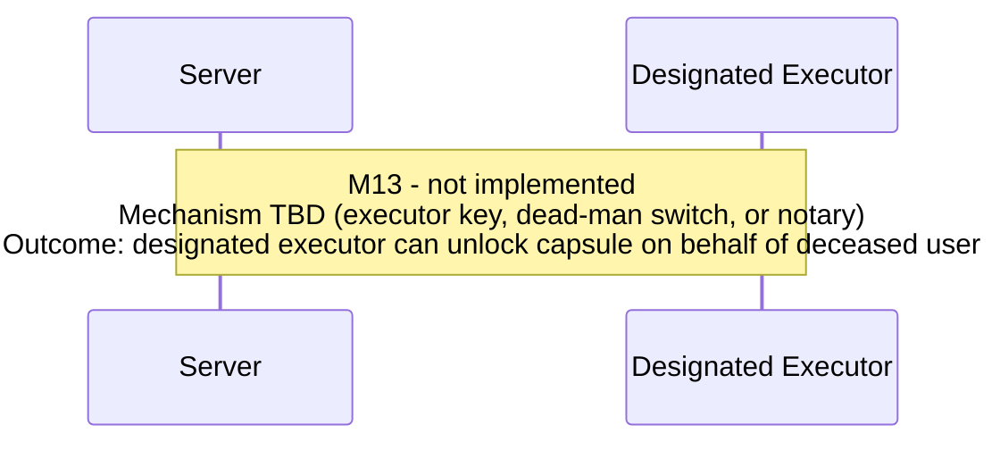

# Capsules — Behavioral Specification

_Derived from: `CapsuleRoutes.kt`, `CapsuleService.kt`_

> **Scope note:** Capsule **delivery** (M12) and **posthumous unlock** (M13) are out of scope for this spec. Those milestones are not yet implemented in the codebase. This document covers creation, editing, sealing, viewing, and cancellation of capsules — all of which are currently implemented.

---

## Use Case Inventory

- **User creates a capsule** — user calls `POST /capsules` with a `shape` ("open" or "sealed"), `unlock_at` (ISO-8601 timestamp with timezone), one or more `recipients` (usernames), optional `upload_ids`, and an optional `message` (max 50,000 bytes); server validates and returns the capsule in "open" or "sealed" state.
- **User lists capsules** — user calls `GET /capsules` with optional `state` filter (open, sealed, delivered, cancelled) and `order` (updated_at or unlock_at).
- **User views capsule detail** — user calls `GET /capsules/{id}` to get full capsule including all uploads, recipients, and current message.
- **User edits an open capsule** — user calls `PATCH /capsules/{id}` to update `unlock_at`, `recipients`, `upload_ids`, or `message`; not allowed once in a terminal state; upload_ids cannot be changed on sealed capsules.
- **User seals an open capsule** — user calls `POST /capsules/{id}/seal`; capsule must be in "open" state and contain at least one upload; moves to "sealed" state (contents become immutable).
- **User cancels a capsule** — user calls `POST /capsules/{id}/cancel`; allowed from "open" or "sealed" states; moves to "cancelled" (terminal state).
- **User views upload's capsule memberships** — user calls `GET /uploads/{id}/capsules` to see which active (open + sealed) capsules contain a given upload; used to block composting of in-capsule uploads.
- **Capsule delivery** — _out of scope (M12)_: delivery mechanism, unlock notification, and recipient viewing flow.
- **Posthumous unlock** — _out of scope (M13)_: posthumous trigger and executor unlock flow.

---

## Capsule States

```
open  →  sealed  →  [delivered — M12, out of scope]
 ↓          ↓
cancelled  cancelled
```

| State | Description |
|-------|-------------|
| `open` | Capsule created with shape="open"; contents mutable |
| `sealed` | Sealed by user; contents immutable; unlock_at mutable |
| `delivered` | Unlock date reached, delivered to recipients (M12 — not implemented) |
| `cancelled` | Cancelled by owner; terminal state |

---

## Sequence Diagrams

### 1. Create Capsule (Open Shape)



### 2. Create Capsule (Sealed Shape — Immediate Seal)



### 3. Edit Open Capsule



### 4. Seal an Open Capsule



### 5. Cancel a Capsule



### 6. List and View Capsules



### 7. Upload Capsule Reverse Lookup (Compost Eligibility)



### 8. Capsule Delivery — STUB (M12, Out of Scope)



### 9. Posthumous Unlock — STUB (M13, Out of Scope)


