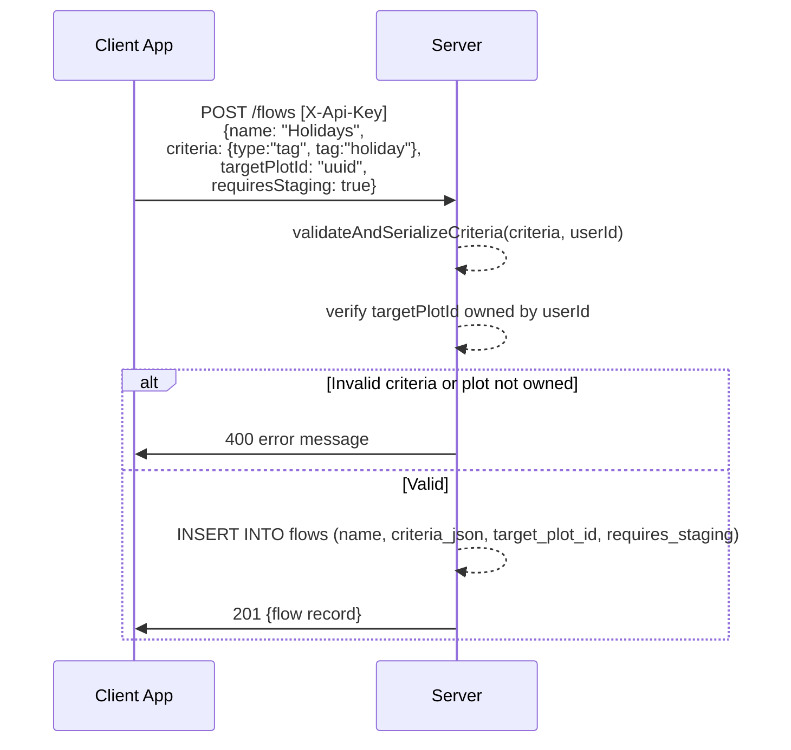
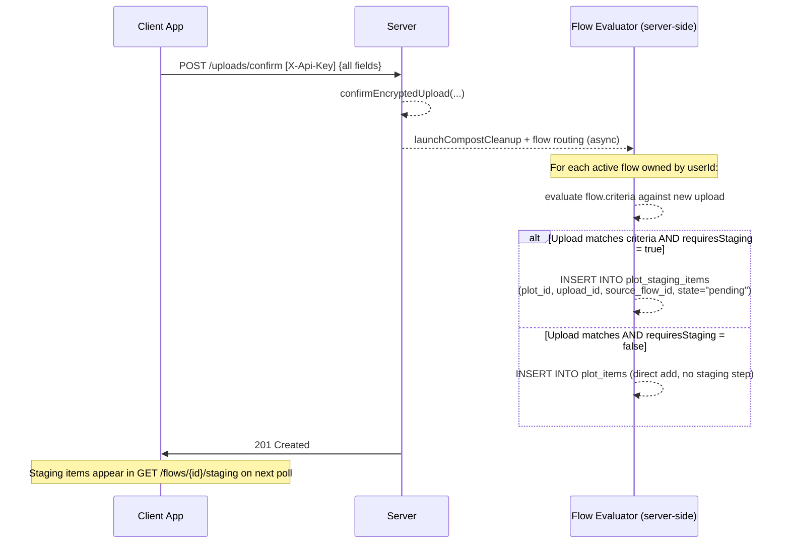
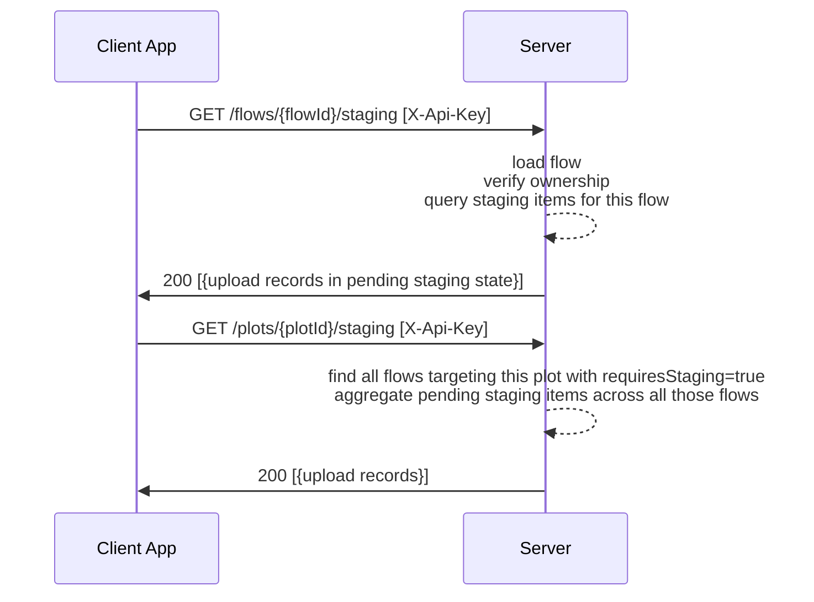
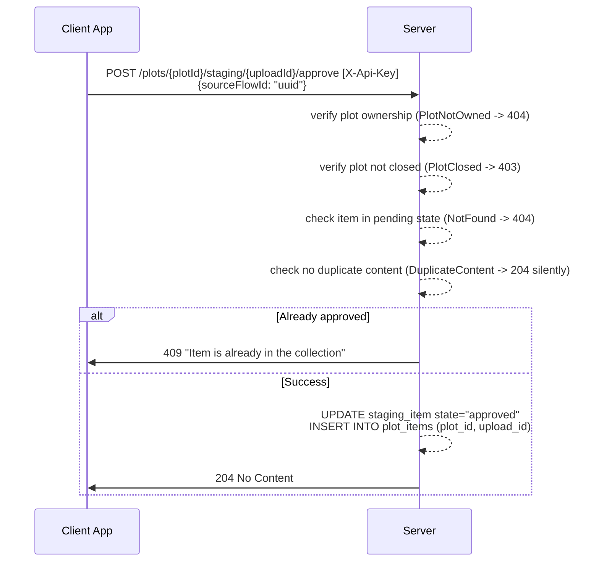
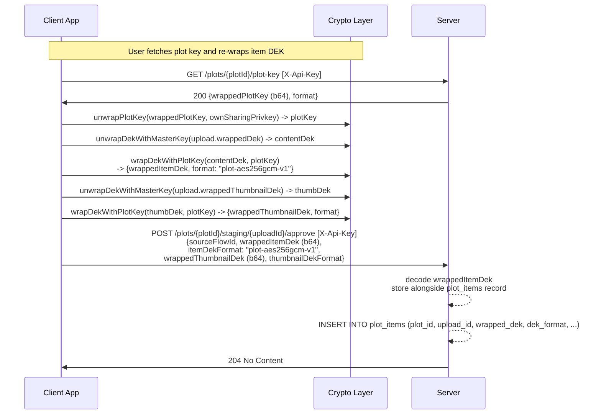
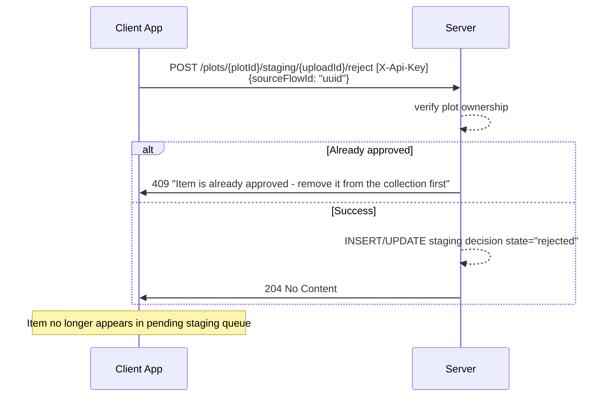
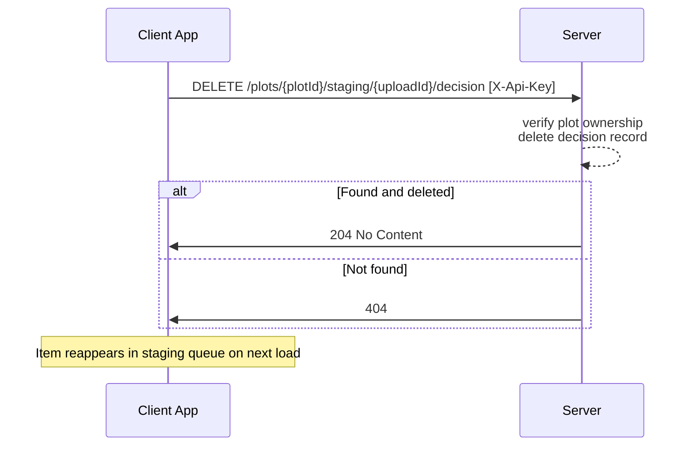
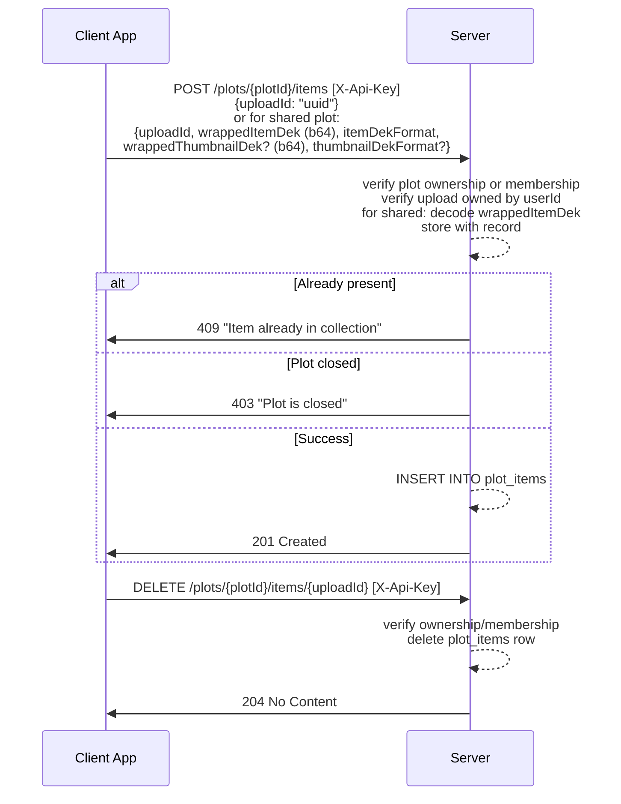
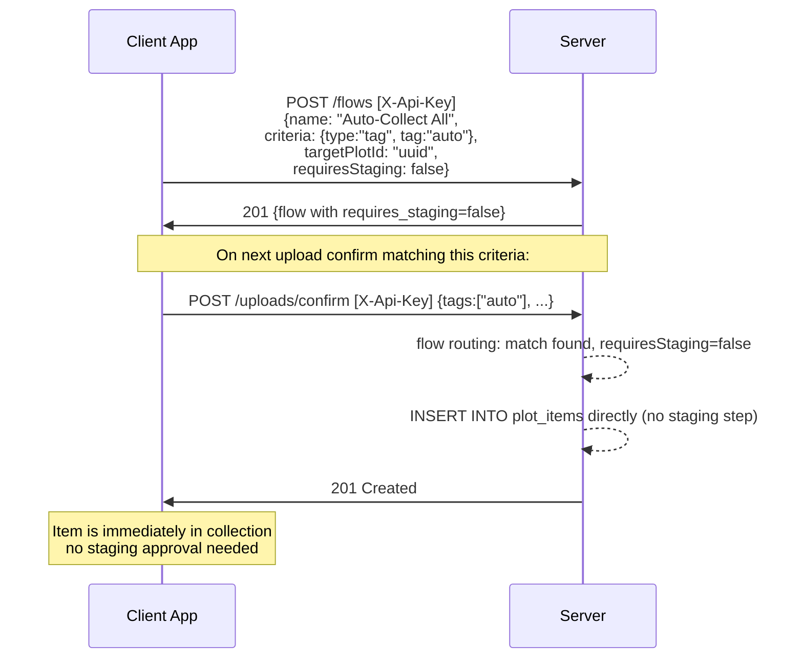

# Flows / Trellises — Behavioral Specification

_Derived from: `FlowRoutes.kt`, `FlowService.kt`, `PlotItemRepository` (inferred from service)_

> **Note on naming:** The codebase uses "Flow" throughout. REF-001 (Flow → Trellis rename) is queued but not yet applied. This spec uses "Flow/Trellis" to indicate the pending rename. All HTTP endpoints currently use `/flows` and `/plots/{id}/staging`.

---

## Use Case Inventory

- **User creates a Flow/Trellis** — user calls `POST /flows` with a name, criteria expression, target plot ID, and `requiresStaging` flag; criteria is validated; target plot must be owned by user.
- **User updates a Flow/Trellis** — user calls `PUT /flows/{id}` to change name, criteria, or `requiresStaging`.
- **User deletes a Flow/Trellis** — user calls `DELETE /flows/{id}`; returns 204 or 404.
- **Auto-routing trigger** — when an upload is confirmed, the server evaluates all active flows for the user; uploads matching a flow's criteria are placed in the staging queue or immediately added to the target plot (if `requiresStaging=false`).
- **User views flow staging queue** — user calls `GET /flows/{id}/staging` to see pending items for a specific flow; or `GET /plots/{id}/staging` to see all pending items for a plot.
- **User approves a staging item** — user calls `POST /plots/{id}/staging/{uploadId}/approve`; for shared plots, client must supply re-wrapped DEK under plot key; item moves from staging to collection.
- **User rejects a staging item** — user calls `POST /plots/{id}/staging/{uploadId}/reject`; item is excluded from this staging pass; can be un-rejected.
- **User un-rejects a staging decision** — user calls `DELETE /plots/{id}/staging/{uploadId}/decision`; removes the rejection record; item re-enters staging queue.
- **User views rejected items** — user calls `GET /plots/{id}/staging/rejected` to review previously rejected items.
- **User manually adds item to collection** — user calls `POST /plots/{id}/items` with `uploadId`; for shared plots, must include re-wrapped DEK.
- **User removes item from collection** — user calls `DELETE /plots/{id}/items/{uploadId}`.
- **`requiresStaging=false` bypass** — flow is configured without staging requirement; matching uploads are automatically added to the target plot collection directly, with no staging step.

---

## Sequence Diagrams

### 1. Create Flow/Trellis

### 2. Auto-Routing Trigger (Upload Confirmed)

### 3. View Staging Queue

### 4. Approve Staging Item (Private Plot)

### 5. Approve Staging Item (Shared Plot — DEK Re-wrap)

### 6. Reject Staging Item

### 7. Un-Reject (Delete Decision)

### 8. Manual Add / Remove Plot Item

### 9. `requiresStaging=false` Direct Add Bypass

