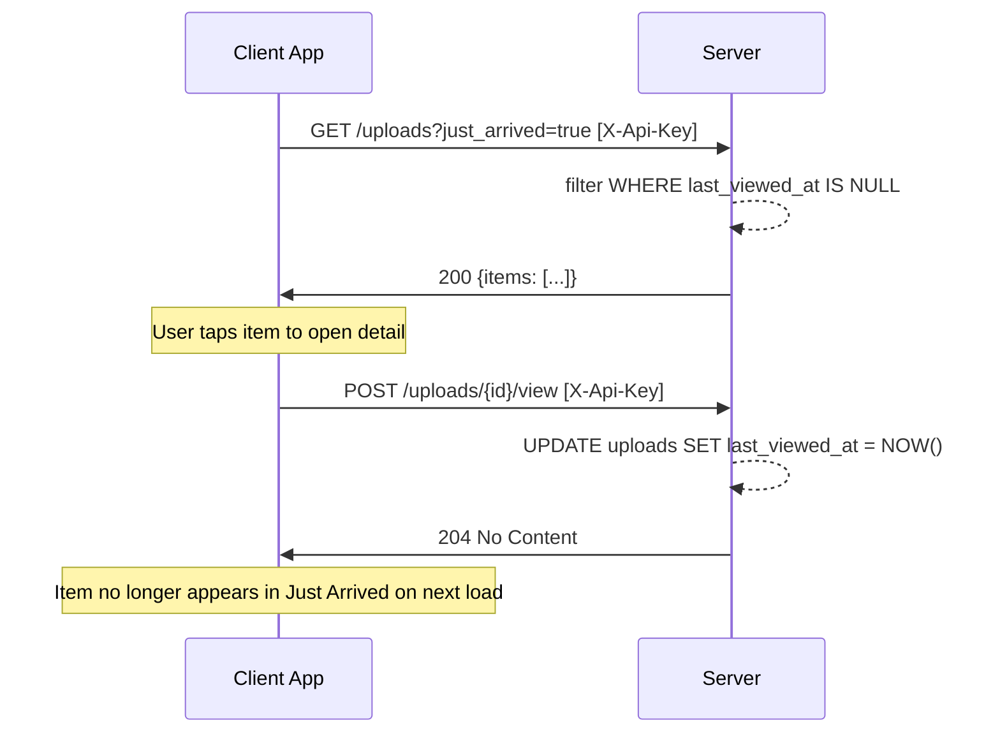
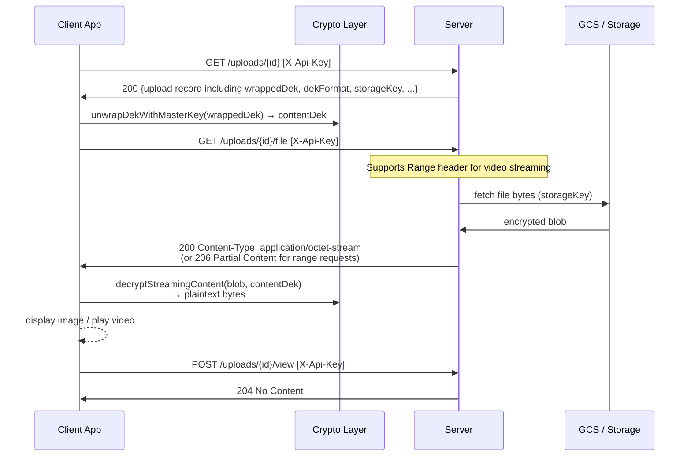
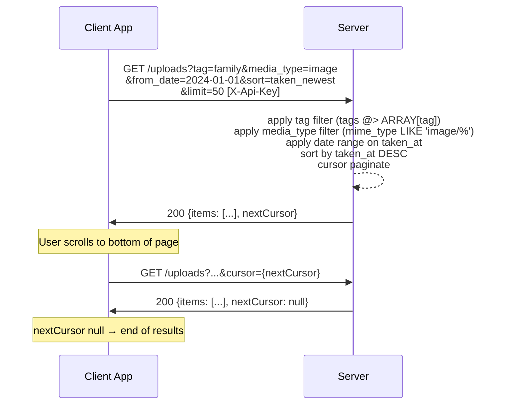
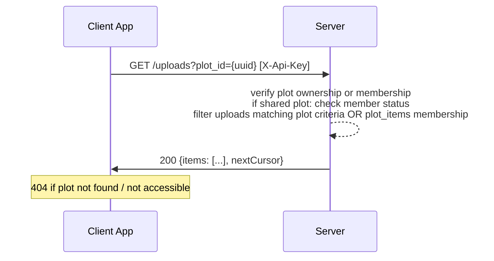
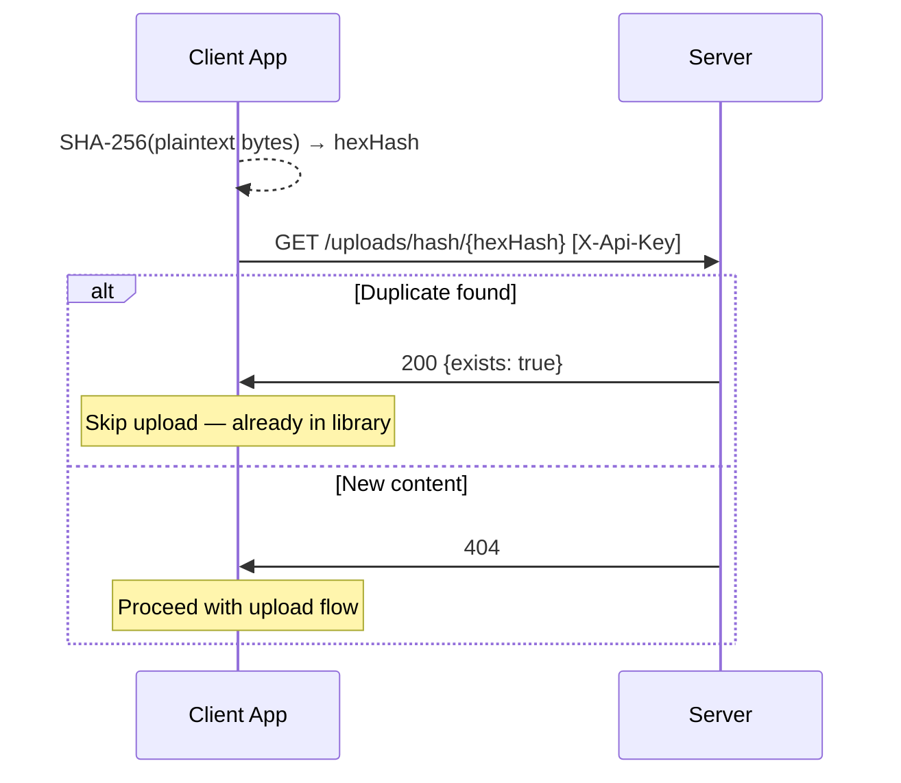

# Garden & Explore — Behavioral Specification

_Derived from: `UploadRoutes.kt`, `UploadService.kt`, `listUploadsHandler`_

---

## Use Case Inventory

- **User loads Garden** — authenticated user fetches their upload list; server returns cursor-paginated results ordered by `upload_newest` by default; client decrypts thumbnails for display.
- **User views Just Arrived** — user requests uploads with `just_arrived=true`; returns items where `last_viewed_at IS NULL`; first detail open clears Just Arrived status via `POST /uploads/{id}/view`.
- **User views a plot row** — user fetches uploads filtered by `plot_id`; server evaluates plot membership or ownership before returning items.
- **User opens photo detail** — client fetches upload record (`GET /uploads/{id}`), then fetches encrypted file bytes (`GET /uploads/{id}/file`), decrypts locally with DEK unwrapped from master key; `POST /uploads/{id}/view` marks as viewed.
- **User fetches thumbnail** — client calls `GET /uploads/{id}/thumb`; for encrypted uploads, server returns the encrypted thumbnail blob (`application/octet-stream`); client decrypts with wrapped thumbnail DEK.
- **User explores with filter + sort** — user sets query params on `GET /uploads`: `tag`, `exclude_tag`, `from_date`, `to_date`, `media_type`, `has_location`, `is_received`, `sort` (upload_newest/upload_oldest/taken_newest/taken_oldest), `in_capsule`; response is cursor-paginated.
- **User checks content hash before upload** — client calls `GET /uploads/hash/{sha256hex}` to detect duplicates before initiating; 200 = exists, 404 = new.

---

## Sequence Diagrams

### 1. Garden Load (Swim-lane)

```mermaid
sequenceDiagram
    participant App as Client App
    participant S as Server
    participant GCS as GCS / Storage

    App->>S: GET /uploads?limit=50&sort=upload_newest [X-Api-Key]
    S-->>S: query uploads for user (not composted)<br/>apply filters; cursor-paginate
    S->>App: 200 {items: [...], nextCursor}

    loop For each visible thumbnail
        App->>S: GET /uploads/{id}/thumb
        S->>GCS: fetch encrypted thumbnail blob
        GCS->>S: blob bytes
        S->>App: 200 Content-Type: application/octet-stream (encrypted)
        App-->>App: unwrapDekWithMasterKey(wrappedThumbDek)<br/>→ thumbDek<br/>decryptSymmetric(blob, thumbDek) → JPEG bytes<br/>display thumbnail
    end
```

### 2. Just Arrived



### 3. Photo Detail — Encrypted File Fetch



### 4. Explore — Filter and Sort



### 5. Plot Row (Filter by Plot)



### 6. Duplicate Check Before Upload


