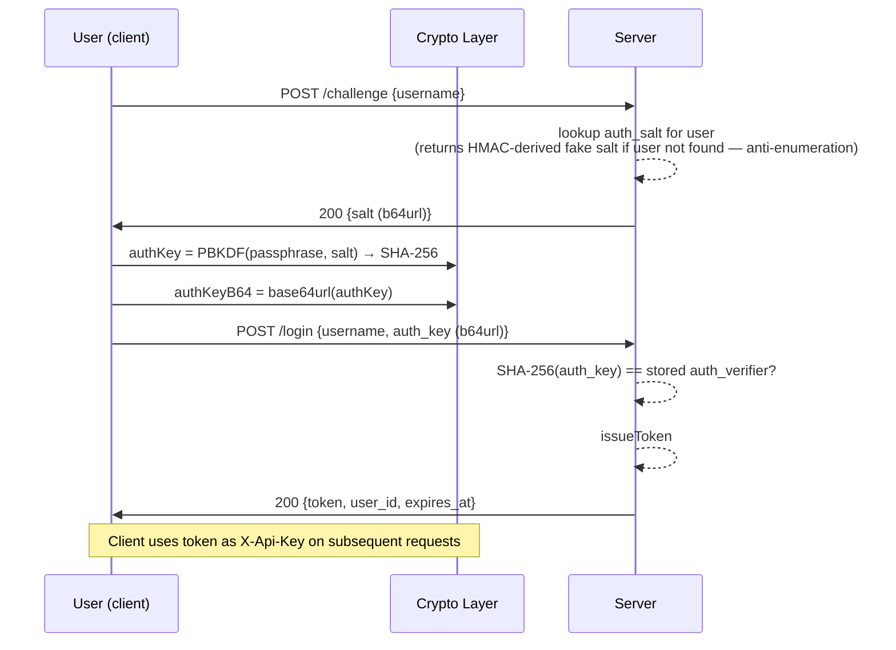

# Onboarding — Behavioral Specification

_Derived from: `AuthRoutes.kt`, `KeysRoutes.kt`, `AuthService.kt`, `vaultCrypto.js`, `EnvelopeCrypto.swift`_

---

## Use Case Inventory

- **Invited user registers** — new user redeems an invite token, choosing a username and passphrase; client generates master key and device key pair, wraps master key to device pubkey (P-256 ECDH) and optionally under passphrase (Argon2id); server creates user, default system plot, and device record; session token returned.
- **Existing user logs in** — user submits username + auth_key derived from passphrase; server validates verifier; session token returned.
- **Founding user sets up passphrase** — existing user without auth credentials calls `POST /setup-existing` to set auth verifier + salt for the first time; optional recovery-wrapped master key stored.
- **QR device pairing (Android → Web)** — authenticated Android user initiates a pairing code; web client enters the code to get a session_id; Android polls link status, sees web's pubkey, wraps master key for web's ephemeral pubkey and posts to `/pairing/complete`; web polls `/pairing/status` until complete, then unwraps master key.
- **Device link (native → native)** — authenticated device calls `POST /link/initiate`; new device calls `POST /link/{id}/register` with its pubkey and the one-time code; trusted device polls `GET /link/{id}/status`, sees the new device's pubkey, wraps master key, posts to `POST /link/{id}/wrap`; new device polls status to get wrapped master key.
- **User generates a friend invite** — authenticated user calls `GET /invites` to obtain an invite token they can share out-of-band; invite valid 48 hours, single-use.

---

## Sequence Diagrams

### 1. New User Registration (full crypto detail)

```mermaid
sequenceDiagram
    participant U as User (client)
    participant C as Crypto Layer
    participant S as Server

    Note over U,C: Client-side key generation (before any network call)
    U->>C: generate masterKey (32 random bytes)
    U->>C: generateKeyPair P-256 → (devicePrivkey, devicePubkey SPKI)
    U->>C: wrapMasterKeyForDevice(masterKey, devicePubkey)<br/>→ p256-ecdh-hkdf-aes256gcm-v1 asymmetric envelope
    U->>C: deriveAuthKey = SHA-256(PBKDF(passphrase, authSalt))
    U->>C: authVerifier = SHA-256(authKey)
    U->>C: wrapMasterKeyWithPassphrase(masterKey, passphrase)<br/>→ argon2id-aes256gcm-v1 envelope + salt + params (optional recovery)

    U->>S: POST /register<br/>{invite_token, username, display_name,<br/> auth_salt (b64url), auth_verifier (b64url),<br/> wrapped_master_key (b64url), wrap_format,<br/> pubkey (b64url), pubkey_format, device_id,<br/> device_label, device_kind,<br/> wrapped_master_key_recovery? (b64url), wrap_format_recovery?}
    S-->>S: validate invite (not used, not expired)
    S-->>S: check username uniqueness
    S-->>S: createUser(username, display_name, auth_verifier, auth_salt)
    S-->>S: createSystemPlot(newUser.id)
    S-->>S: insertWrappedKey(device record + wrapped_master_key)
    S-->>S: upsertRecoveryPassphrase (if provided)
    S-->>S: markInviteUsed; createFriendship(inviter, newUser)
    S-->>S: issueToken → session_token
    S->>U: 201 {token, user_id, expires_at}

    Note over U,C: Client unwraps master key via device private key<br/>(already in memory from generation step)
```

### 2. Login Flow



### 3. Founding User Passphrase Setup

```mermaid
sequenceDiagram
    participant U as User (client)
    participant C as Crypto Layer
    participant S as Server

    Note over U,C: User already has device key; no auth_verifier set yet
    U->>C: generate authSalt (16 random bytes)
    U->>C: authKey = PBKDF(passphrase, authSalt)
    U->>C: authVerifier = SHA-256(authKey)
    U->>C: wrapMasterKeyWithPassphrase(masterKey, passphrase)<br/>→ argon2id envelope (optional recovery blob)

    U->>S: POST /setup-existing<br/>{username, device_id, auth_salt (b64url),<br/> auth_verifier (b64url),<br/> wrapped_master_key_recovery? (b64url), wrap_format_recovery?}
    S-->>S: verify username has no auth_verifier yet
    S-->>S: verify device_id belongs to user
    S-->>S: setUserAuth(auth_verifier, auth_salt)
    S-->>S: upsertRecoveryPassphrase (if provided)
    S-->>S: issueToken
    S->>U: 200 {token, user_id, expires_at}
```

### 4. QR Device Pairing (Android → Web)

```mermaid
sequenceDiagram
    participant A as Android (trusted)
    participant W as Web (new device)
    participant C as Web Crypto
    participant S as Server

    A->>S: POST /pairing/initiate [X-Api-Key: android_token]
    S-->>S: generate 8-digit numeric code; store pairing record
    S->>A: 200 {one_time_code, expires_at}

    Note over A,W: User reads code on Android screen; types into web app

    W->>S: POST /pairing/qr {code}
    S-->>S: validate code → create session_id; store in pairing record
    S->>W: 200 {session_id}

    Note over W,C: Web generates ephemeral device key pair for this session

    loop Poll until state = "device_registered"
        A->>S: GET /link/{linkId}/status  [or web polls /pairing/status?session_id=...]
        S->>A: 200 {state: "pending"}
    end

    Note over W,C: Web posts pubkey to register itself on the pairing link
    W->>S: POST /link/{linkId}/register {code, deviceId, deviceLabel, deviceKind, pubkeyFormat, pubkey}
    S->>W: 202 Accepted

    A->>S: GET /link/{linkId}/status
    S->>A: 200 {state: "device_registered", newPubkeyFormat, newPubkey (b64)}

    A->>C: wrapMasterKeyForDevice(masterKey, newPubkey)<br/>→ p256-ecdh-hkdf-aes256gcm-v1 envelope
    A->>S: POST /pairing/complete [X-Api-Key: android_token]<br/>{session_id, wrapped_master_key (b64url), wrap_format}
    S-->>S: issueToken for web session; store wrapped_master_key
    S->>A: 200 {ok: true}

    loop Web polls until complete
        W->>S: GET /pairing/status?session_id={id}
        S->>W: 200 {state: "wrap_complete", session_token,<br/> wrapped_master_key (b64), wrap_format, expires_at}
    end

    W->>C: unwrapMasterKeyForDevice(wrapped_master_key, webDevicePrivkey)
    Note over W,C: Master key now in memory; web session established
```

### 5. Device Link (Native to Native)

```mermaid
sequenceDiagram
    participant T as Trusted Device
    participant N as New Device
    participant C as Trusted Device Crypto
    participant S as Server

    T->>S: POST /link/initiate [X-Api-Key: trusted_token]
    S-->>S: generate code + linkId; state = "initiated"
    S->>T: 200 {linkId, code}

    Note over T,N: User shares code out-of-band (e.g., displays on trusted device)

    N->>C: generateKeyPair P-256 → (newPrivkey, newPubkey)
    N->>S: POST /link/{linkId}/register {code, deviceId, deviceLabel, deviceKind, pubkeyFormat, pubkey}
    S-->>S: state → "device_registered"; store new device pubkey
    S->>N: 202 Accepted

    loop Trusted polls for device_registered state
        T->>S: GET /link/{linkId}/status
        S->>T: 200 {state: "device_registered", newDeviceKind, newPubkeyFormat, newPubkey (b64)}
    end

    T->>C: wrapMasterKeyForDevice(masterKey, newPubkey)<br/>→ p256-ecdh-hkdf-aes256gcm-v1 envelope
    T->>S: POST /link/{linkId}/wrap [X-Api-Key: trusted_token]<br/>{wrappedMasterKey (b64), wrapFormat}
    S-->>S: insertWrappedKey for new device; state → "wrap_complete"
    S->>T: 201 {new device record}

    loop New device polls for wrap_complete
        N->>S: GET /link/{linkId}/status
        S->>N: 200 {state: "wrap_complete", wrappedMasterKey (b64), wrapFormat}
    end

    N->>C: unwrapMasterKeyForDevice(wrappedMasterKey, newPrivkey)
    Note over N,C: Master key in memory; new device fully set up
```

### 6. Friend Invite Generation and Redemption

```mermaid
sequenceDiagram
    participant I as Inviter
    participant F as Friend (new user)
    participant S as Server

    I->>S: GET /invites [X-Api-Key]
    S-->>S: generate 32-byte random token; store invite (expires 48h)
    S->>I: 200 {token, expires_at}

    Note over I,F: Inviter shares link out-of-band (SMS, email, etc.)

    Note over F,S: Friend follows registration flow (see diagram 1)<br/>POST /register with {invite_token, ...}
    S-->>S: markInviteUsed(invite.id, newUser.id)
    S-->>S: createFriendship(invite.createdBy, newUser.id)
    S->>F: 201 {token, user_id, expires_at}

    Note over I,F: Inviter and new user are now friends automatically
```
