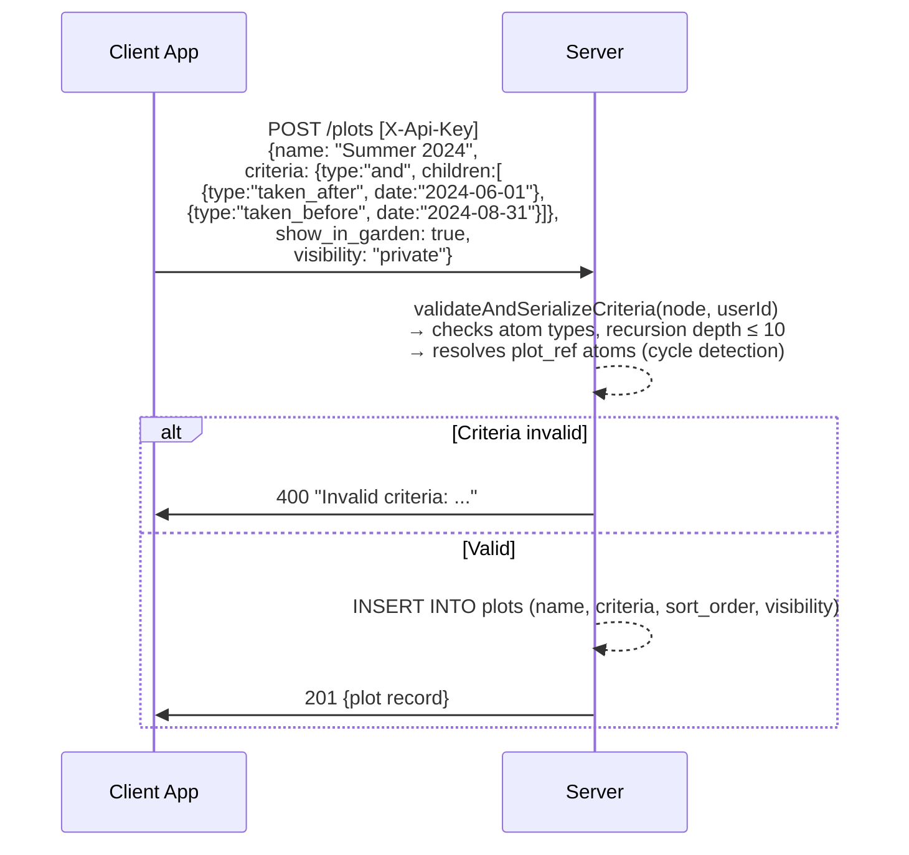
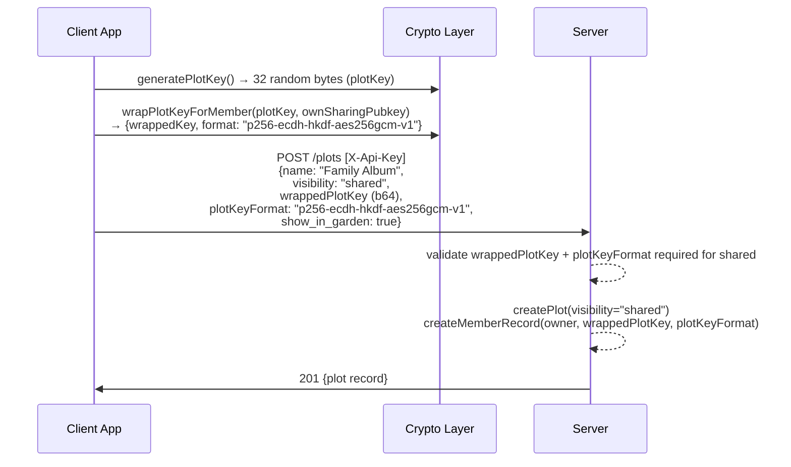
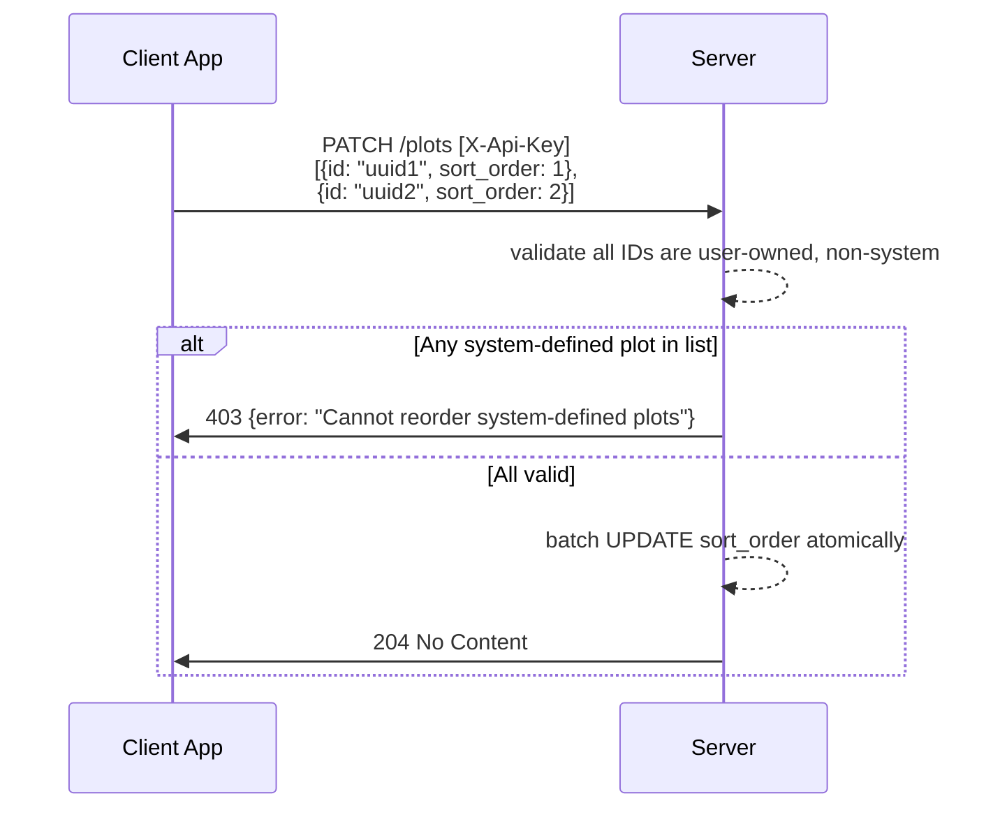
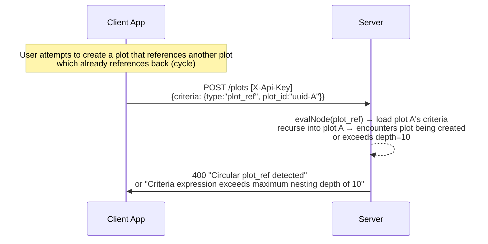

# Plots — Behavioral Specification

_Derived from: `PlotRoutes.kt`, `PlotService.kt`, `CriteriaEvaluator.kt`_

---

## Use Case Inventory

- **User lists plots** — authenticated user calls `GET /plots`; returns all plots owned by the user ordered by `sort_order`; system-defined plots are included.
- **User creates a private plot** — user calls `POST /plots` with a name and optional criteria JSON; visibility defaults to `"private"`; criteria atoms are validated server-side.
- **User creates a shared plot** — user calls `POST /plots` with `visibility: "shared"` and provides `wrappedPlotKey` (plot key wrapped to owner's sharing pubkey) and `plotKeyFormat`; creates the plot and member record for owner.
- **User edits a plot** — user calls `PUT /plots/{id}` to update name, sort_order, showInGarden, and/or criteria; system-defined plots return 403.
- **User deletes a private plot** — user calls `DELETE /plots/{id}`; system-defined plots return 403.
- **User reorders plots** — user calls `PATCH /plots` with an array of `{id, sort_order}` objects; batch update is atomic.
- **User hides a plot from Garden** — user calls `PUT /plots/{id}` with `show_in_garden: false`; plot still appears in sidebar but not in garden layout.
- **User builds a criteria expression** — user combines atom types using `and`/`or`/`not` logical operators; server validates each atom type and detects cycles in `plot_ref` atoms (max depth 10).

---

## Criteria Atom Types

The following atom types are validated by `CriteriaEvaluator.kt`:

| Type | Required Fields | Description |
|------|----------------|-------------|
| `tag` | `tag` (string) | Items tagged with a specific tag |
| `media_type` | `value` ("image" or "video") | Filter by MIME type prefix |
| `taken_after` | `date` (ISO date) | `taken_at >= date` |
| `taken_before` | `date` (ISO date) | `taken_at < date + 1 day` |
| `uploaded_after` | `date` (ISO date) | `uploaded_at >= date` |
| `uploaded_before` | `date` (ISO date) | `uploaded_at < date + 1 day` |
| `has_location` | — | GPS coordinates present |
| `device_make` | `value` (string, ILIKE) | Camera make (legacy plaintext only) |
| `device_model` | `value` (string, ILIKE) | Camera model (legacy plaintext only) |
| `is_received` | — | `shared_from_user_id IS NOT NULL` |
| `received_from` | `user_id` (UUID) | Received from specific friend |
| `in_capsule` | — | Contained in an active capsule |
| `plot_ref` | `plot_id` (UUID) | Items that match another plot's criteria |
| `and` | `children` (array) | Logical AND |
| `or` | `children` (array) | Logical OR |
| `not` | `child` (node) | Logical NOT |

---

## Sequence Diagrams

### 1. List Plots

```mermaid
sequenceDiagram
    participant App as Client App
    participant S as Server

    App->>S: GET /plots [X-Api-Key]
    S-->>S: SELECT * FROM plots WHERE owner_user_id = userId<br/>ORDER BY sort_order ASC
    S->>App: 200 [{plot records including criteria JSON, visibility, showInGarden, ...}]
    Note over App: System plots (Just Arrived, Compost, etc.) are included;<br/>they cannot be edited or deleted
```

### 2. Create Private Plot with Criteria



### 3. Create Shared Plot (with E2EE plot key)



### 4. Edit Plot

```mermaid
sequenceDiagram
    participant App as Client App
    participant S as Server

    App->>S: PUT /plots/{id} [X-Api-Key]<br/>{name: "New Name", show_in_garden: false,<br/> criteria: {type: "tag", tag: "vacation"}}
    S-->>S: load plot; check ownership
    alt System-defined plot
        S->>App: 403 {error: "Cannot modify a system-defined plot"}
    else User-defined
        S-->>S: validateAndSerializeCriteria if criteria provided
        S-->>S: UPDATE plots SET name, show_in_garden, criteria
        S->>App: 200 {updated plot record}
    end
```

### 5. Delete Plot

```mermaid
sequenceDiagram
    participant App as Client App
    participant S as Server

    App->>S: DELETE /plots/{id} [X-Api-Key]
    S-->>S: load plot; check ownership
    alt System-defined
        S->>App: 403 {error: "Cannot delete a system-defined plot"}
    else Not found
        S->>App: 404
    else User-defined
        S-->>S: DELETE FROM plots WHERE id = plotId AND owner_user_id = userId
        S->>App: 204 No Content
    end
```

### 6. Batch Reorder Plots



### 7. Plot Reference Cycle Detection


