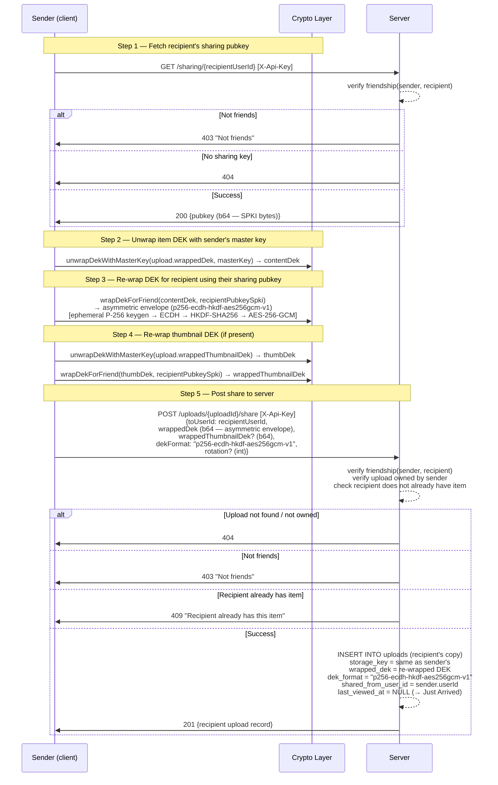
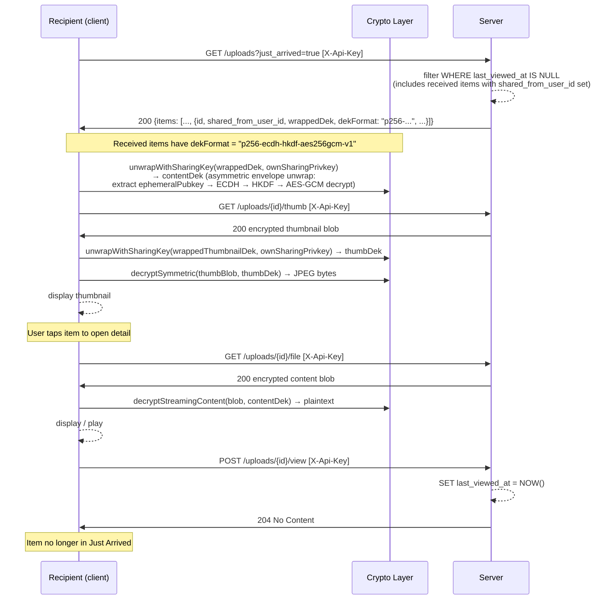
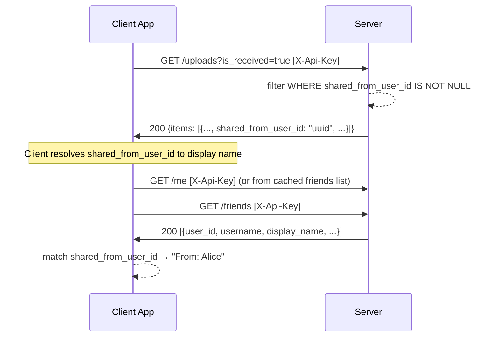

# Sending & Receiving — Behavioral Specification

_Derived from: `UploadRoutes.kt` (`shareUploadContractRoute`), `UploadService.kt` (`shareUpload`), `SharingKeyRoutes.kt`, `vaultCrypto.js` (`wrapDekForFriend`, `unwrapWithSharingKey`)_

---

## Use Case Inventory

- **User shares an item with a friend** — sender unwraps the item's DEK using their master key, re-wraps the DEK using the recipient's sharing pubkey (P-256 ECDH), and calls `POST /uploads/{id}/share`; server creates a recipient upload record linked to the original item.
- **Recipient views received items in Just Arrived** — recipient fetches uploads with `just_arrived=true` or `is_received=true`; received items have `shared_from_user_id` set; client decrypts by unwrapping the re-wrapped DEK with their own sharing private key.
- **Recipient views attribution** — upload record includes `shared_from_user_id` which the client resolves to a display name for attribution ("From: Alice").
- **User uploads their sharing key pair** — user calls `PUT /sharing` with their sharing pubkey (SPKI) and wrapped private key (wrapped under master key); this key pair is used for item and plot key distribution.
- **User retrieves own sharing key** — user calls `GET /sharing/me` to fetch their sharing keypair (e.g., on a new device, to restore sharing capability).
- **User retrieves a friend's sharing public key** — user calls `GET /sharing/{userId}` to get a friend's pubkey before wrapping a DEK or plot key for them; server enforces friendship.

---

## Sequence Diagrams

### 1. Share Item to Friend (DEK Re-wrap, Full Crypto Detail)



### 2. Recipient Receives in Just Arrived



### 3. Attribution Display



### 4. Upload and Retrieve Sharing Key Pair

```mermaid
sequenceDiagram
    participant App as Client App
    participant C as Crypto Layer
    participant S as Server

    Note over App,C: On first setup or new device — generate sharing key pair
    App->>C: generateKeyPair P-256 → (sharingPrivkey, sharingPubkeySpki)
    App->>C: wrapDekUnderMasterKey(sharingPrivkeyBytes, masterKey)<br/>→ wrappedPrivkey (master-aes256gcm-v1 envelope)

    App->>S: PUT /sharing [X-Api-Key]<br/>{pubkey (b64 SPKI bytes),<br/> wrappedPrivkey (b64),<br/> wrapFormat: "master-aes256gcm-v1"}
    S-->>S: upsert sharing_keys record for userId
    S->>App: 204 No Content

    Note over App,C: On another device — restore sharing key
    App->>S: GET /sharing/me [X-Api-Key]
    S->>App: 200 {pubkey (b64), wrappedPrivkey (b64), wrapFormat}
    App->>C: unwrapDekWithMasterKey(wrappedPrivkey, masterKey) → sharingPrivkeyBytes
    App->>C: importSharingPrivkey(sharingPrivkeyBytes) → CryptoKey
    Note over App,C: Sharing private key restored; can decrypt received items + plot keys
```
