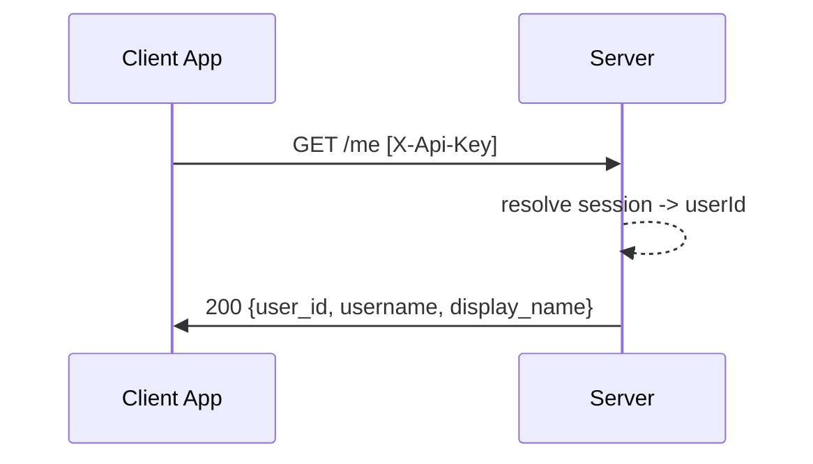
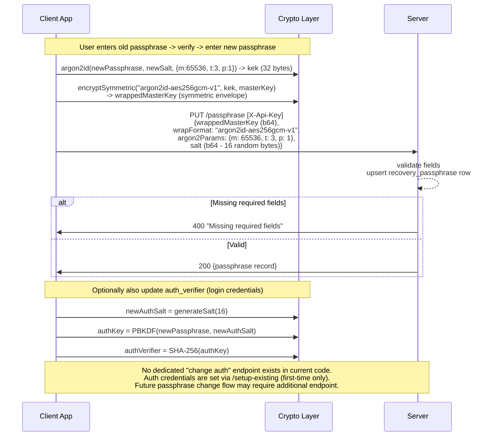
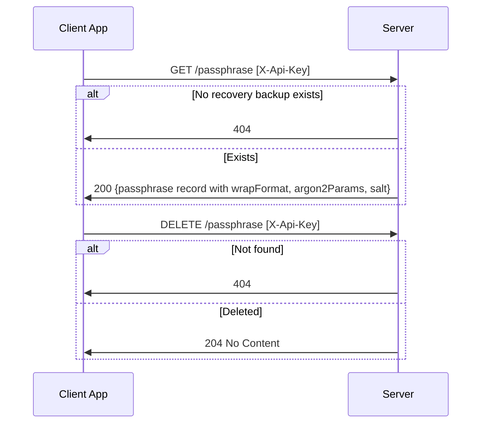
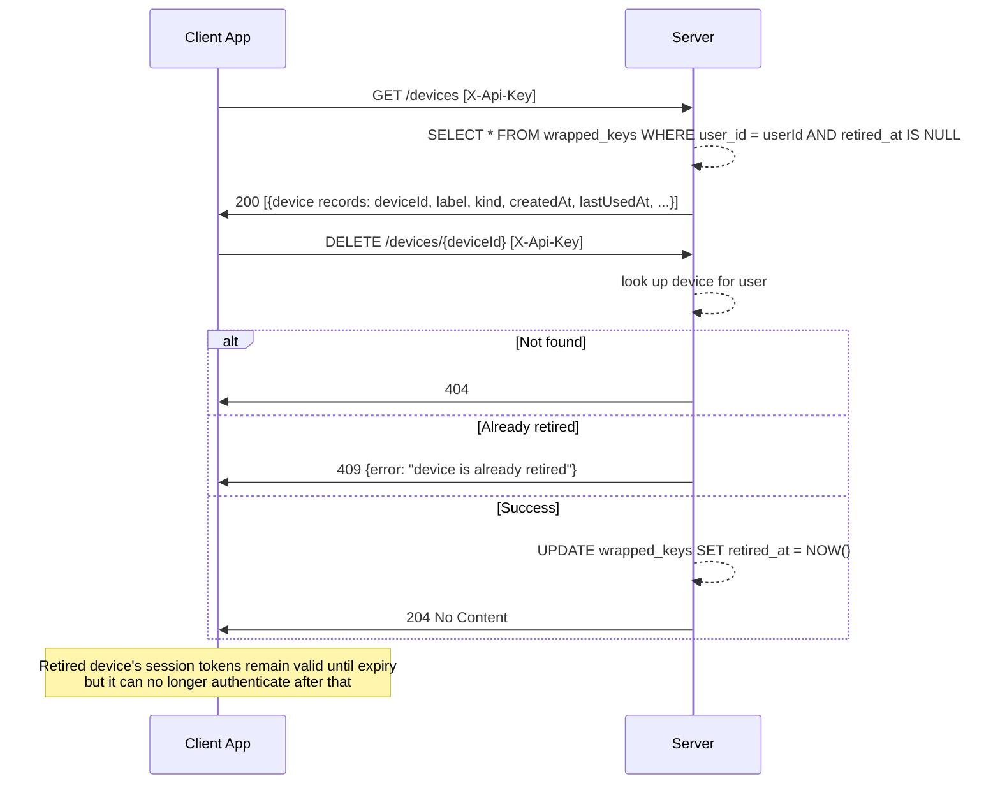
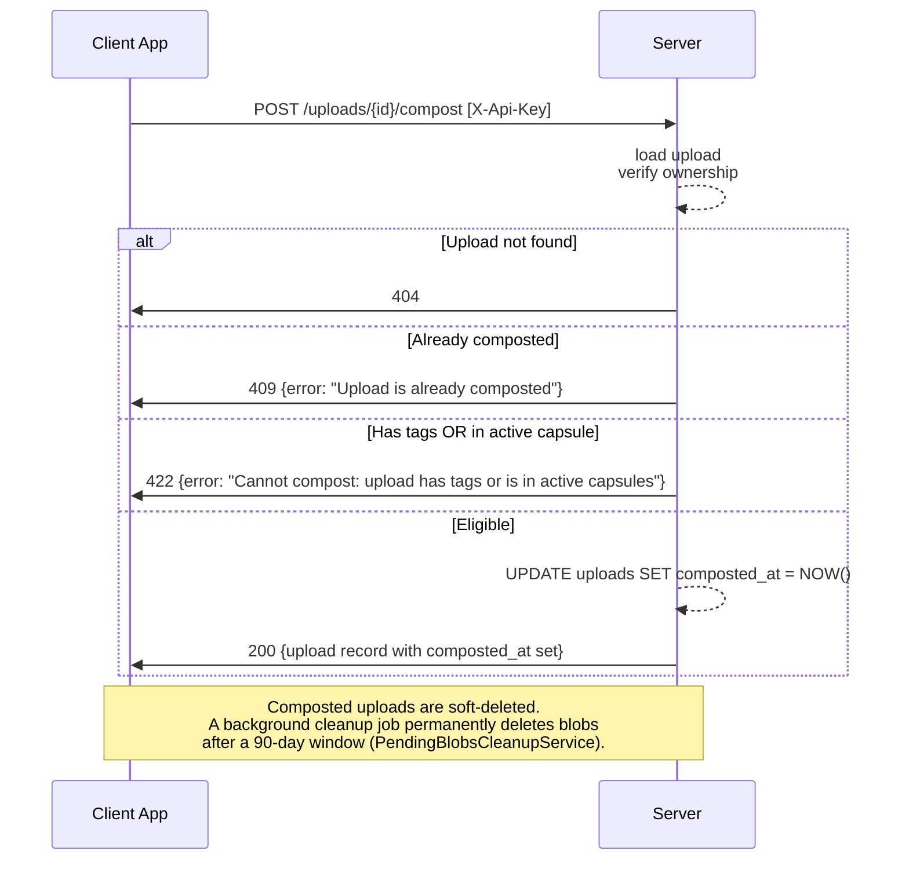
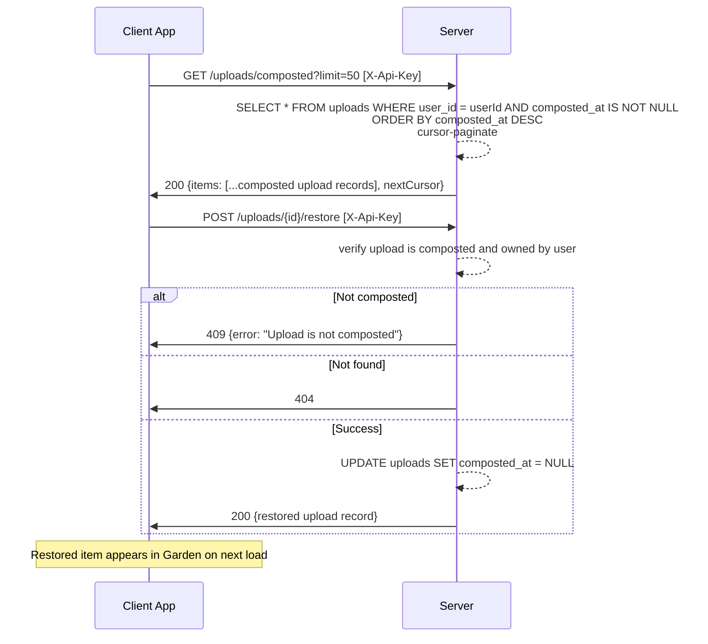
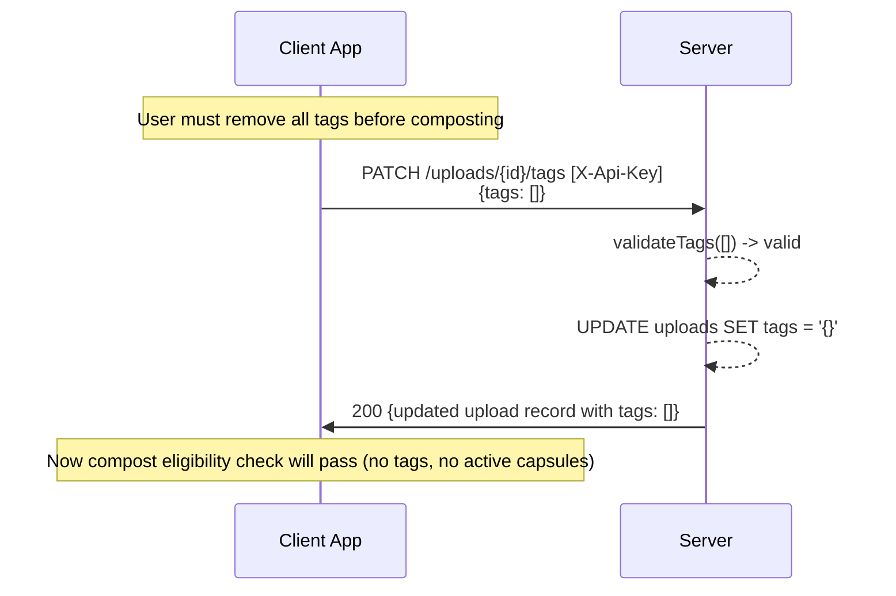
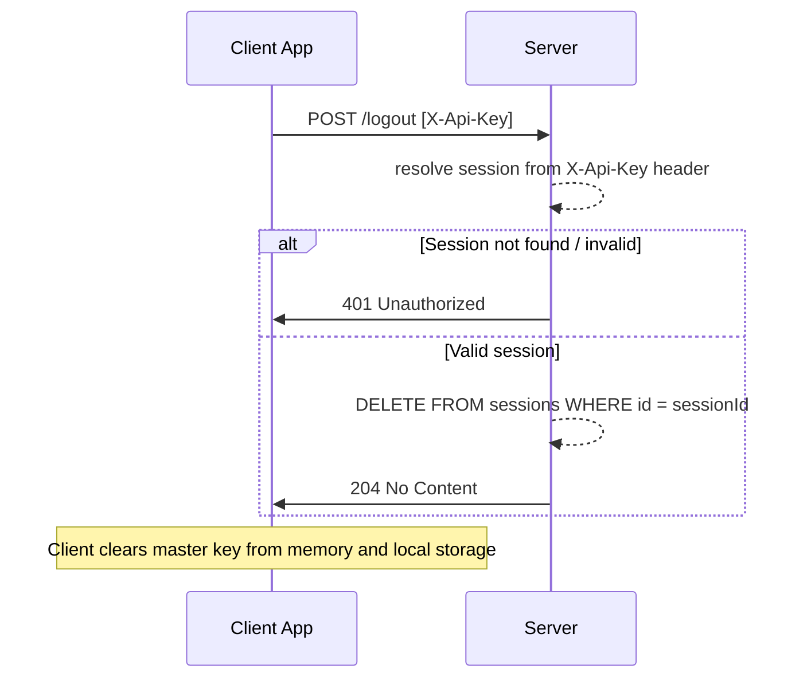

# Settings & Compost — Behavioral Specification

_Derived from: `KeysRoutes.kt`, `KeyService.kt`, `UploadRoutes.kt`, `UploadService.kt`, `AuthRoutes.kt`_

---

## Use Case Inventory

- **User views account info** — user calls `GET /me` to see their user ID, username, and display name.
- **User changes passphrase** — user generates a new auth salt + verifier, re-wraps master key with new passphrase (Argon2id), and calls `PUT /passphrase` to store the new recovery blob; optionally updates auth credentials server-side.
- **User sets up recovery passphrase** — user calls `PUT /passphrase` with passphrase-wrapped master key blob, Argon2id params, and salt; overwrites existing recovery blob (upsert).
- **User retrieves recovery passphrase record** — user calls `GET /passphrase` to check if a recovery blob exists.
- **User deletes recovery passphrase** — user calls `DELETE /passphrase` to remove the backup.
- **User lists devices** — user calls `GET /devices` to see all active (non-retired) device registrations.
- **User retires a device** — user calls `DELETE /devices/{deviceId}` to soft-retire a device (sets `retired_at`); retired devices cannot authenticate.
- **User composts an upload** — user calls `POST /uploads/{id}/compost`; requires that the upload has no tags and is not in any active capsule; soft-deletes by setting `composted_at`; 90-day cleanup window applies.
- **User views composted uploads** — user calls `GET /uploads/composted` for a cursor-paginated list of composted items.
- **User restores a composted upload** — user calls `POST /uploads/{id}/restore` to un-compost and return the item to the active garden.
- **User logs out** — user calls `POST /logout` to invalidate the current session token.

---

## Sequence Diagrams

### 1. View Account Info

### 2. Change Passphrase (Argon2id Re-wrap)

### 3. Get / Delete Recovery Passphrase

### 4. List and Retire Devices

### 5. Compost an Upload (Eligibility Check)

### 6. View and Restore Composted Uploads

### 7. Set Tags (Prerequisite for Compost Eligibility)

### 8. Logout

