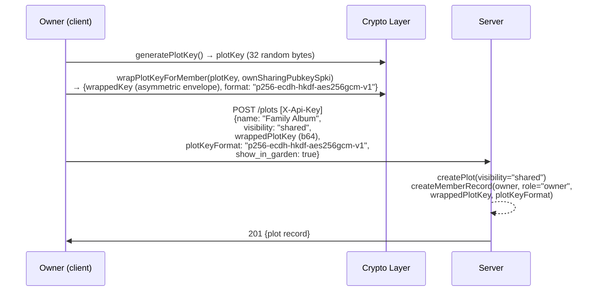
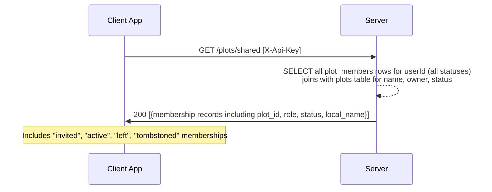
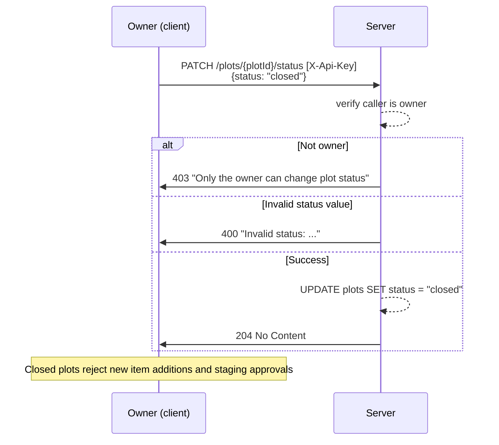

# Shared Plots — Behavioral Specification

_Derived from: `SharedPlotRoutes.kt`, `SharedPlotService.kt`, `PlotRoutes.kt`, `vaultCrypto.js`_

---

## Use Case Inventory

- **Owner creates shared plot** — user creates a plot with `visibility: "shared"`, providing plot key wrapped to their own sharing pubkey; server stores plot + owner member record.
- **Owner invites a friend** — owner calls `POST /plots/{id}/members` with friend's `userId`, `wrappedPlotKey` (plot key re-wrapped to friend's sharing pubkey), and `plotKeyFormat`; friend must already be in friends list.
- **Join via invite link (async key distribution)** — owner calls `POST /plots/{id}/invites` to get a 48-hour token; recipient calls `GET /plots/join-info?token=...` to preview, then `POST /plots/join` with their sharing pubkey; owner's client polls `GET /plots/{id}/members/pending`, sees the request, wraps plot key for recipient, and calls `POST /plots/{id}/members/pending/{inviteId}/confirm`; recipient then calls `POST /plots/{id}/accept`.
- **Member lists shared plots** — user calls `GET /plots/shared` to see all memberships (all statuses).
- **Member fetches plot key** — member calls `GET /plots/{id}/plot-key` to retrieve their wrapped copy of the plot key.
- **Member adds item to shared plot** — member calls `POST /plots/{id}/items` with upload ID and DEK re-wrapped under the plot key.
- **Staging approval with DEK re-wrap** — owner or admin approves staging item by re-wrapping the item DEK under the shared plot key (see flows-trellises.md diagram 5).
- **Member leaves plot** — member calls `POST /plots/{id}/leave` or `DELETE /plots/{id}/members/me`; owner must transfer ownership first.
- **Owner transfers ownership** — owner calls `POST /plots/{id}/transfer` with `newOwnerId`; target must be an active member.
- **Owner opens/closes plot** — owner calls `PATCH /plots/{id}/status` with `{status: "open" | "closed"}`.
- **Member rejoins after leaving** — member calls `POST /plots/{id}/rejoin`; fails if plot is tombstoned.
- **Restore tombstoned plot** — the member who triggered tombstoning calls `POST /plots/{id}/restore` within the restore window.

---

## Key Concepts

- **Plot key**: a 32-byte symmetric key (`plot-aes256gcm-v1`) shared among all members. Each member stores their own copy wrapped to their sharing pubkey via `p256-ecdh-hkdf-aes256gcm-v1`.
- **Item DEK re-wrap**: when an item is added to a shared plot, its DEK (previously wrapped under the user's master key) is unwrapped client-side and re-wrapped under the plot key. Only the re-wrapped DEK is stored server-side for the plot_items row.
- **Pending join flow**: implemented via `plot_plot_key_requests` (pending_plot_key_requests in server). Recipient registers their pubkey; owner wraps and confirms server-side. Server never sees the plot key in plaintext.

---

## Sequence Diagrams

### 1. Create Shared Plot



### 2. Invite Friend Directly (Member Already Known)

```mermaid
sequenceDiagram
    participant Owner as Owner (client)
    participant C as Crypto Layer
    participant S as Server

    Note over Owner,C: Owner already has friend's sharing pubkey
    Owner->>S: GET /sharing/{friendUserId} [X-Api-Key]
    S-->>S: verify friendship; return friend's pubkey
    S->>Owner: 200 {pubkey (b64)}

    Owner->>S: GET /plots/{plotId}/plot-key [X-Api-Key]
    S->>Owner: 200 {wrappedPlotKey (b64), format}

    Owner->>C: unwrapPlotKey(wrappedPlotKey, ownSharingPrivkey) → plotKey
    Owner->>C: wrapPlotKeyForMember(plotKey, friendSharingPubkeySpki)<br/>→ {wrappedKey, format: "p256-ecdh-hkdf-aes256gcm-v1"}

    Owner->>S: POST /plots/{plotId}/members [X-Api-Key]<br/>{userId: friendUserId,<br/> wrappedPlotKey (b64),<br/> plotKeyFormat: "p256-ecdh-hkdf-aes256gcm-v1"}
    S-->>S: verify ownership or membership<br/>verify friendship(owner, friend)<br/>check not already member
    alt Not friends
        S->>Owner: 400 "You can only invite friends"
    else Already member
        S->>Owner: 409 "User is already a member"
    else Success
        S-->>S: INSERT INTO plot_members (plotId, userId, role="member",<br/>  wrapped_plot_key, plot_key_format)
        S->>Owner: 201 Created
    end
```

### 3. Join via Invite Link (Async Key Distribution)

```mermaid
sequenceDiagram
    participant Owner as Owner (client)
    participant C as Owner Crypto
    participant Recipient as Recipient (client)
    participant S as Server

    Owner->>S: POST /plots/{plotId}/invites [X-Api-Key]
    S-->>S: generate 48-hour token; store invite record
    S->>Owner: 201 {token, expires_at}

    Note over Owner,Recipient: Owner shares invite link out-of-band

    Recipient->>S: GET /plots/join-info?token={token} [X-Api-Key]
    S-->>S: validate token (not expired, not used)
    S->>Recipient: 200 {plotId, plotName, inviterDisplayName, inviterUserId}

    Recipient->>S: POST /plots/join [X-Api-Key]<br/>{token,<br/> recipientSharingPubkey (b64 — recipient's sharing pubkey)}
    S-->>S: redeemInvite: create pending_plot_key_request<br/>(store recipient pubkey, invite_id, state="pending")
    S->>Recipient: 200 {state: "pending", inviteId, inviterDisplayName}

    loop Owner polls for pending joins
        Owner->>S: GET /plots/{plotId}/members/pending [X-Api-Key]
        S->>Owner: 200 [{inviteId, recipientPubkey, ...}]
    end

    Owner->>C: unwrapPlotKey(wrappedPlotKey, ownSharingPrivkey) → plotKey
    Owner->>C: wrapPlotKeyForMember(plotKey, recipientSharingPubkeySpki)<br/>→ {wrappedPlotKey, format: "p256-ecdh-hkdf-aes256gcm-v1"}

    Owner->>S: POST /plots/{plotId}/members/pending/{inviteId}/confirm [X-Api-Key]<br/>{wrappedPlotKey (b64), plotKeyFormat}
    S-->>S: create member record with status="invited"<br/>store wrapped plot key for recipient
    S->>Owner: 204 No Content

    Note over Recipient,S: Recipient's client is notified / polls
    Recipient->>S: POST /plots/{plotId}/accept [X-Api-Key]<br/>{localName: "Family Album"}
    S-->>S: update membership status → "active"
    S->>Recipient: 204 No Content

    Note over Recipient,C: Recipient can now fetch their wrapped plot key
    Recipient->>S: GET /plots/{plotId}/plot-key [X-Api-Key]
    S->>Recipient: 200 {wrappedPlotKey (b64), format}
    Recipient->>C: unwrapPlotKey(wrappedPlotKey, recipientSharingPrivkey) → plotKey
    Note over Recipient,C: Plot key in memory; can decrypt plot items
```

### 4. Member Adds Item to Shared Plot

```mermaid
sequenceDiagram
    participant Member as Member (client)
    participant C as Crypto Layer
    participant S as Server

    Member->>S: GET /plots/{plotId}/plot-key [X-Api-Key]
    S->>Member: 200 {wrappedPlotKey (b64), format}

    Member->>C: unwrapPlotKey(wrappedPlotKey, sharingPrivkey) → plotKey
    Member->>C: unwrapDekWithMasterKey(upload.wrappedDek) → contentDek
    Member->>C: wrapDekWithPlotKey(contentDek, plotKey)<br/>→ {wrappedItemDek, format: "plot-aes256gcm-v1"}
    Member->>C: unwrapDekWithMasterKey(upload.wrappedThumbnailDek) → thumbDek
    Member->>C: wrapDekWithPlotKey(thumbDek, plotKey) → {wrappedThumbDek, format}

    Member->>S: POST /plots/{plotId}/items [X-Api-Key]<br/>{uploadId,<br/> wrappedItemDek (b64), itemDekFormat: "plot-aes256gcm-v1",<br/> wrappedThumbnailDek? (b64), thumbnailDekFormat?}
    S-->>S: verify membership; verify upload ownership<br/>store wrapped_dek with plot_items row
    alt Not a member
        S->>Member: 404
    else Plot closed
        S->>Member: 403 "Plot is closed"
    else Already present
        S->>Member: 409 "Item already in collection"
    else Success
        S->>Member: 201 Created
    end
```

### 5. List Shared Memberships



### 6. Transfer Ownership and Leave

```mermaid
sequenceDiagram
    participant Owner as Owner (client)
    participant S as Server

    Owner->>S: POST /plots/{plotId}/transfer [X-Api-Key]<br/>{newOwnerId: "uuid"}
    S-->>S: verify caller is owner<br/>verify newOwner is active member
    alt Not owner
        S->>Owner: 403 "Only the owner can transfer ownership"
    else Target not active member
        S->>Owner: 400 "Target user is not an active member"
    else Success
        S-->>S: UPDATE role to "owner" for newOwner; demote caller to "member"
        S->>Owner: 204 No Content
    end

    Owner->>S: POST /plots/{plotId}/leave [X-Api-Key]
    S-->>S: verify membership; owner must have already transferred
    S->>Owner: 204 No Content
```

### 7. Open / Close Plot


