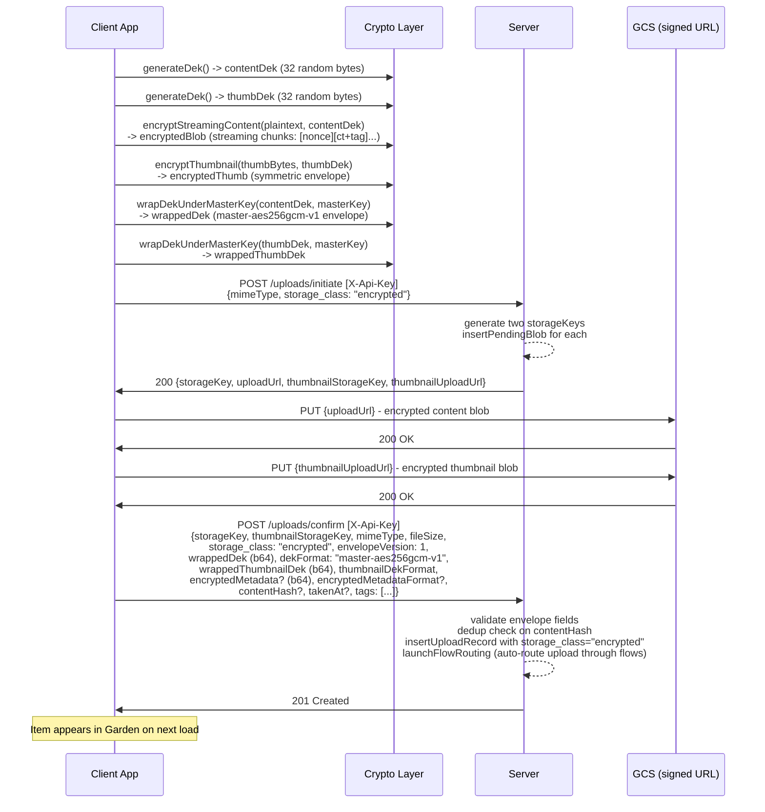
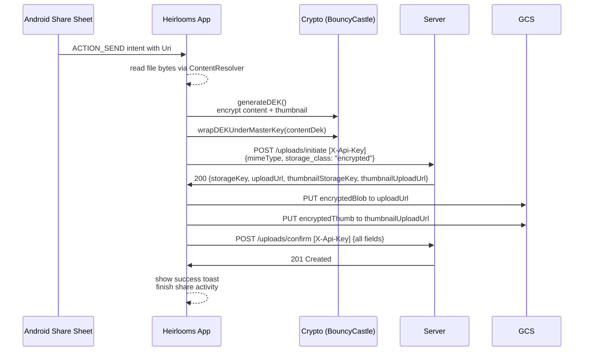
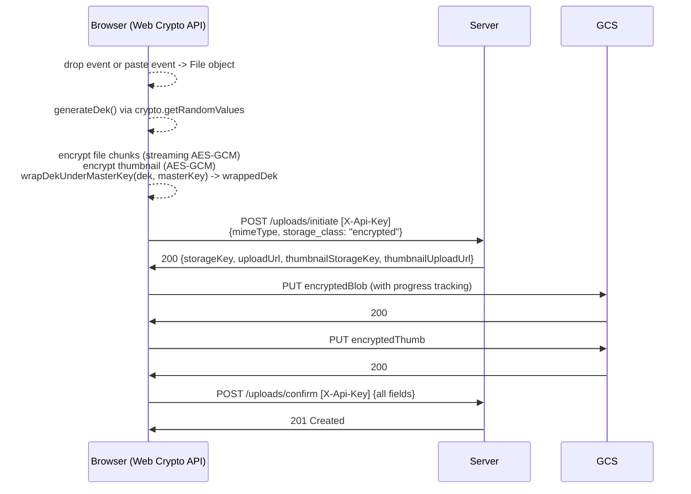
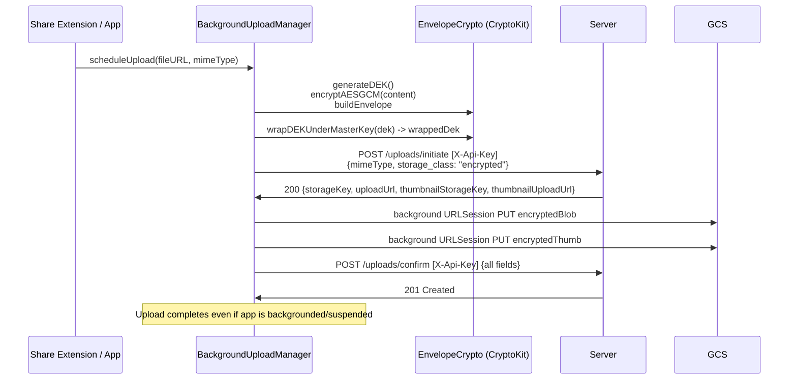
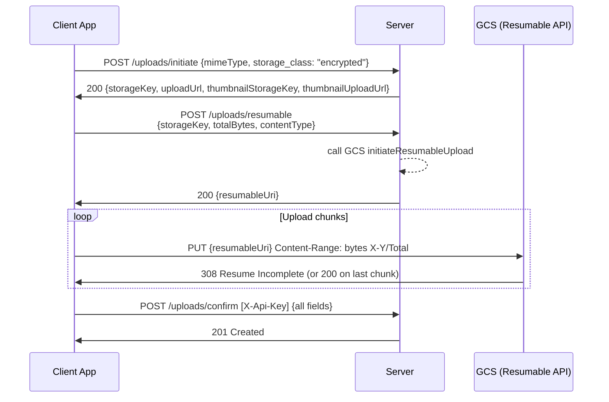
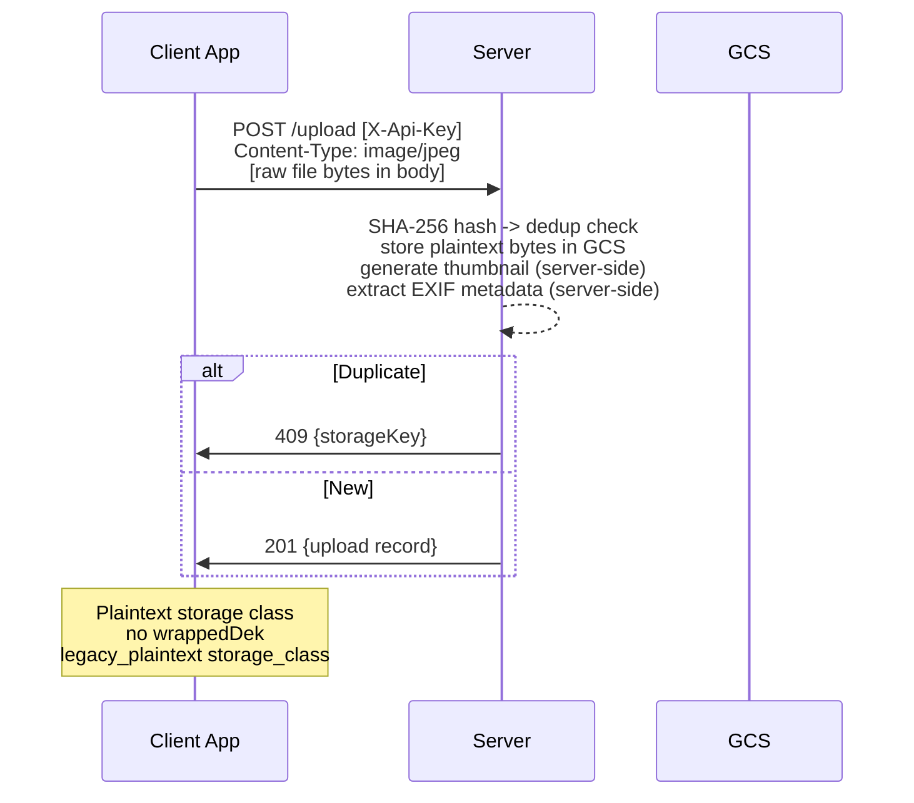

# Uploading — Behavioral Specification

_Derived from: `UploadRoutes.kt`, `UploadService.kt`, `HeirloomsAPI.swift`, `vaultCrypto.js`, `BackgroundUploadManager.swift`_

---

## Use Case Inventory

- **Android share-sheet upload** — user shares image/video from another app into Heirlooms; app reads file bytes, generates DEK, encrypts content + thumbnail, calls `POST /uploads/initiate` (encrypted), PUTs ciphertext blobs to signed GCS URLs, calls `POST /uploads/confirm` with wrapped DEKs.
- **Web drag-and-drop upload** — user drops file onto web app; client generates DEK, encrypts in the browser using Web Crypto API, initiates and confirms upload through the same GCS direct-upload path.
- **Web paste upload** — user pastes an image from clipboard; same encryption and upload flow as drag-and-drop.
- **iOS share extension upload** — iOS share extension passes a URL/data to `BackgroundUploadManager`; same E2EE initiate → PUT → confirm flow; upload runs in background URLSession.
- **Upload with resumable session** — for large files, client calls `POST /uploads/resumable` to get a GCS resumable session URI, then chunks the PUT; confirm is identical.
- **Legacy (plaintext) upload** — `POST /upload` (body-upload, no E2EE); content stored plaintext in GCS; server generates thumbnail; deprecated path retained for backward compat.
- **Upload progress feedback** — client tracks progress against total bytes during PUT to GCS signed URL; no server-side progress endpoint; client is responsible for UI feedback.
- **Tag assignment at upload time** — client includes `tags: [...]` in the confirm body; server validates (no empty strings, max 64 chars per tag, no spaces).

---

## Sequence Diagrams

### 1. E2EE Upload — Initiate → PUT → Confirm (primary path)

### 2. Android Share-Sheet Upload (Swim-lane)

### 3. Web Drag-and-Drop / Paste Upload (Swim-lane)

### 4. iOS Background Upload (Swim-lane)

### 5. Resumable Upload (Large Files)

### 6. Legacy Plaintext Upload (Deprecated Path)

