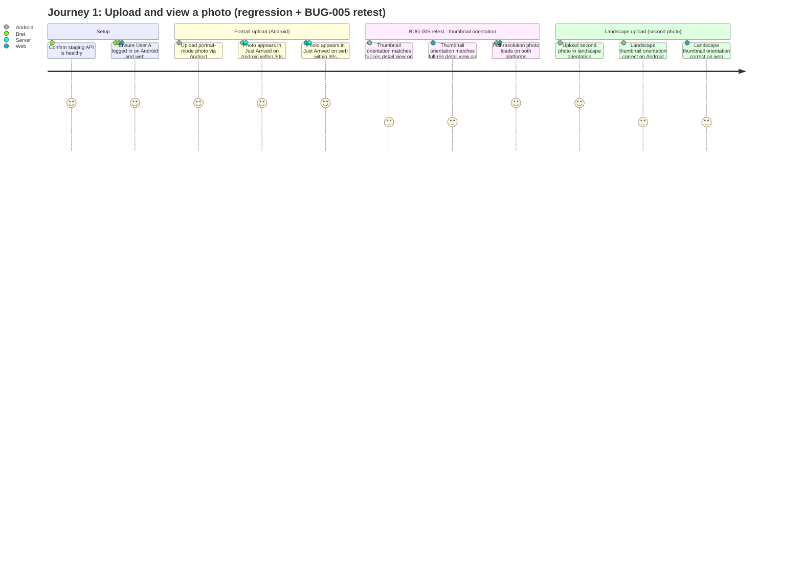
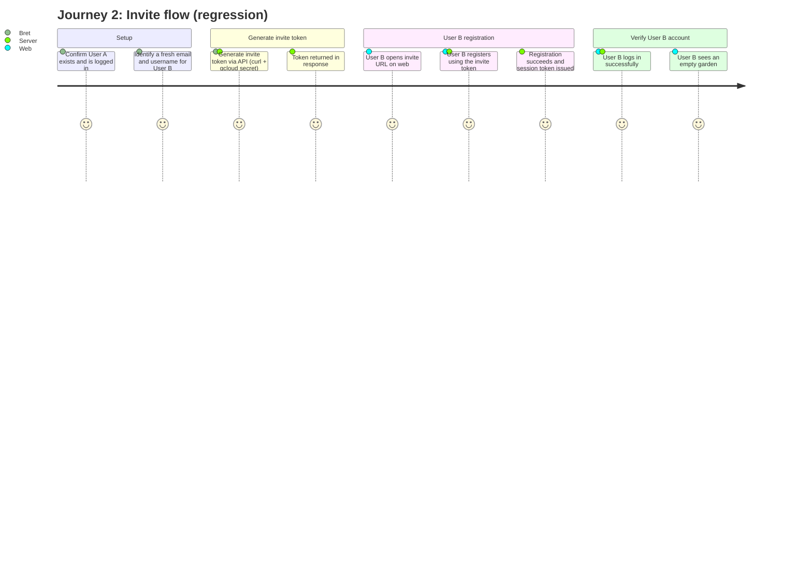
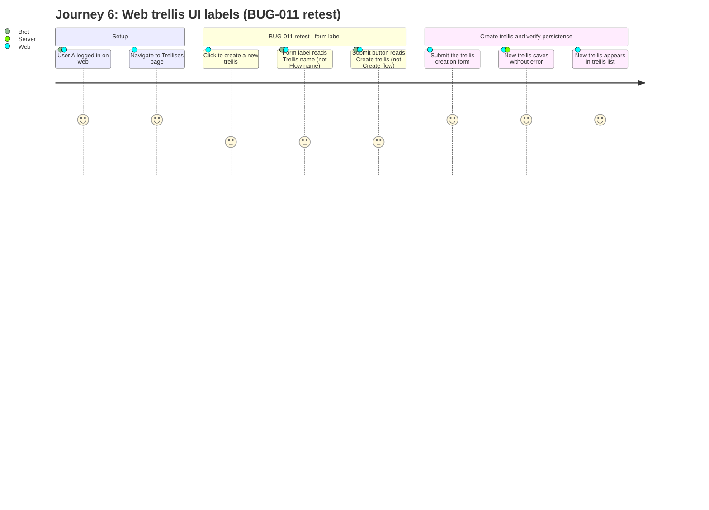
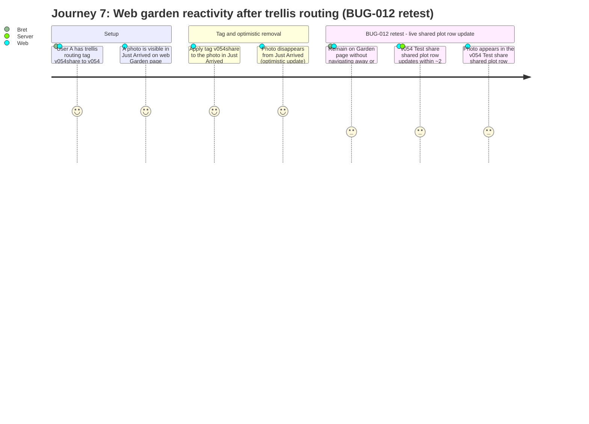
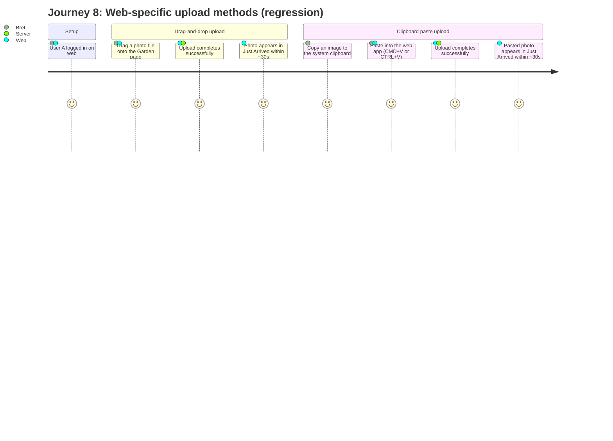
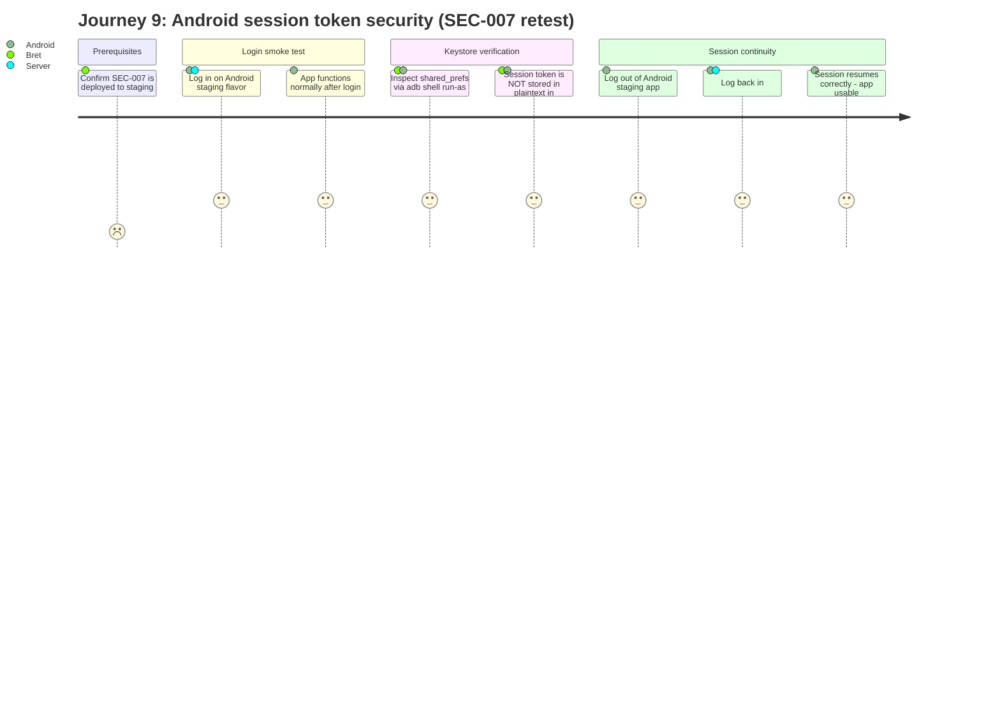
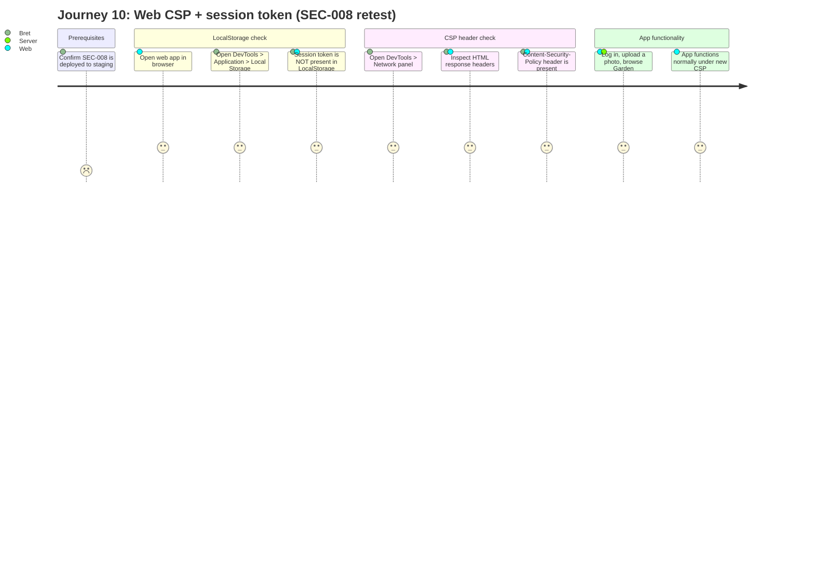
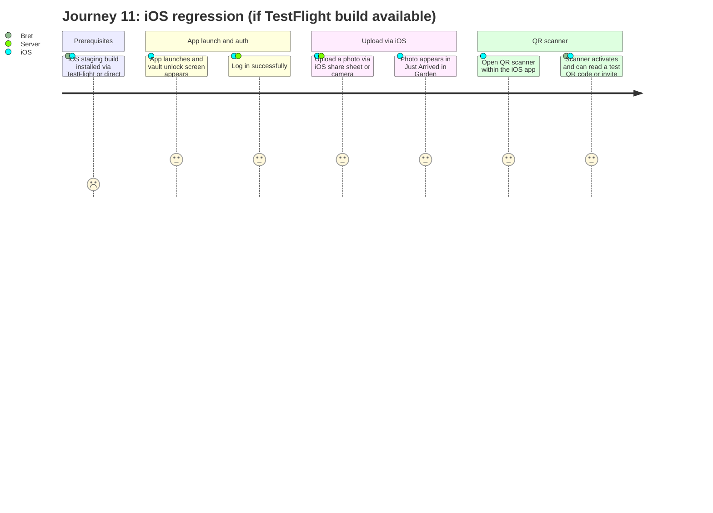

# TST-007 Journey Diagrams — v0.54 Manual Staging Checklist

## What these diagrams represent

These are **test journey diagrams**, not protocol-level sequence diagrams. Each `journey` block
describes the steps a tester walks through when executing a specific test journey from the
TST-007 manual staging checklist. Satisfaction scores (1–5) express expected test confidence:
- **5** — established happy-path regression; expected to pass every iteration
- **3** — new bug fix being retested this iteration; moderate confidence
- **1** — conditional path or uncertain outcome (e.g. depends on a deployment flag)

For the underlying protocol flows (crypto, API sequences, state machines) see the spec docs:
- `docs/specs/uploading.md` — upload E2EE flows
- `docs/specs/onboarding.md` — registration, login, device pairing
- `docs/specs/shared-plots.md` — shared plot membership and key distribution
- `docs/specs/flows-trellises.md` — trellis creation, auto-routing, staging approval

---

## Journey dependency table

| Journey | Title | Depends on |
|---------|-------|------------|
| 1 | Upload and view a photo | — |
| 2 | Invite flow | — |
| 3 | Friend connection | Journey 2 |
| 4 | Shared plot + staging approval | Journey 3 |
| 5 | Member trellis creation for shared plot | Journey 4 |
| 6 | Web trellis UI labels | — (standalone) |
| 7 | Web garden reactivity after trellis routing | Journey 4 (or fresh setup) |
| 8 | Web-specific upload methods | — |
| 9 | Android session token security (SEC-007) | — (conditional on deployment) |
| 10 | Web CSP + session token (SEC-008) | — (conditional on deployment) |
| 11 | iOS regression | — (conditional on TestFlight build) |
| 12 | Android flavor smoke | Journey 4 (shared plot must exist) |

---

## Journey 1: Upload and view a photo



---

## Journey 2: Invite flow



---

## Journey 3: Friend connection

```mermaid
journey
  title Journey 3: Friend connection (regression)
  section Prerequisites
    Journey 2 complete - User A and User B both exist: 5: Bret
  section Automatic friendship at invite redemption
    Confirm friendship created via API for User A: 5: Bret, Server
    Confirm friendship created via API for User B: 5: Bret, Server
  section Android friends list UI
    User A opens burger menu on Android: 5: Android
    User A navigates to Friends screen: 5: Android
    User B appears in User A friends list: 5: Android
  section Web (no standalone friends list - expected)
    Confirm web has no separate friends list page: 5: Web
```

---

## Journey 4: Shared plot and staging approval

```mermaid
journey
  title Journey 4: Shared plot + staging approval (regression + BUG-008, BUG-009 retest)
  section Prerequisites
    Journey 3 complete - User A and User B are friends: 5: Bret
  section Create shared plot
    User A creates new shared plot v054 Test share: 5: Android
    Shared plot appears in User A plot list: 5: Android
  section BUG-008 retest - invite link domain
    User A generates share invite link via Android: 3: Android
    Verify link reads test.heirlooms.digital (not heirlooms.digital): 3: Bret, Android
  section User B joins shared plot
    User B opens the invite link in browser: 5: Web
    User B joins v054 Test share: 5: Web, Server
    Both users see shared plot in their plot lists: 5: Android, Web
  section Trellis and upload setup
    User A creates trellis - tag v054share to v054 Test share (requires_staging=true): 5: Android
    User A uploads photo tagged v054share: 5: Android, Server
    Upload routes to staging queue for shared plot: 5: Server
  section BUG-009 retest - cold-start staging approval
    User A force-kills and reopens Android app: 3: Android
    User A navigates directly to Shared > v054 Test share: 3: Android
    User A approves staged item WITHOUT visiting Garden first: 3: Android
    Approval succeeds - no error toast: 3: Android, Server
    Approved photo appears in shared plot for User A: 5: Android
    Approved photo appears in shared plot for User B: 5: Android, Web
```

---

## Journey 5: Member trellis creation for shared plot

```mermaid
journey
  title Journey 5: Member trellis creation for shared plot (BUG-010 retest)
  section Prerequisites
    Journey 4 complete - User B is a member of v054 Test share: 5: Bret
  section BUG-010 retest - shared plot in member dropdown
    User B opens web trellis creation form: 3: Web
    v054 Test share appears in target plot dropdown: 3: Web
  section Member creates trellis targeting shared plot
    User B creates trellis - tag b-share to v054 Test share (requires_staging=true): 3: Web, Server
    Trellis saved and visible in User B trellis list: 3: Web
  section Member upload routes to shared staging queue
    User B uploads photo tagged b-share: 3: Web, Server
    Upload routes to staging queue for v054 Test share: 3: Server
  section Owner approval
    User A (owner) opens staging queue for v054 Test share on Android: 5: Android
    User A approves the item: 5: Android, Server
    Photo appears in v054 Test share for both users: 5: Android, Web
```

---

## Journey 6: Web trellis UI labels



---

## Journey 7: Web garden reactivity after trellis routing



---

## Journey 8: Web-specific upload methods



---

## Journey 9: Android session token security



---

## Journey 10: Web CSP and session token storage



---

## Journey 11: iOS regression



---

## Journey 12: Android flavor smoke test

```mermaid
journey
  title Journey 12: Android flavor smoke test (regression)
  section Prerequisites
    Android staging flavor (burnt-orange icon, v0.54 APK) installed: 5: Bret, Android
    Journey 4 complete - v054 Test share shared plot exists: 5: Bret
  section App launch and auth
    App launches and vault unlock screen appears: 5: Android
    Log in as User A: 5: Android, Server
  section Key screens
    Garden screen loads with Just Arrived row: 5: Android
    Shared screen shows v054 Test share: 5: Android
  section Trellis labels regression
    Open Trellises screen: 5: Android
    All labels read Trellis (not Flow): 5: Android, Bret
```
